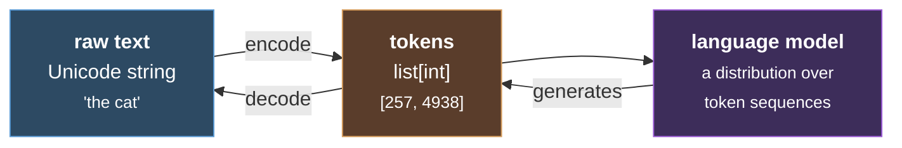
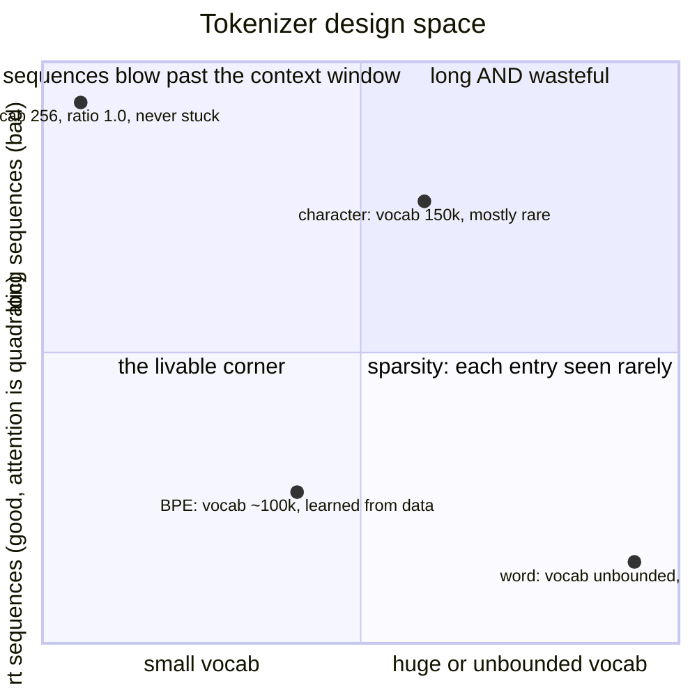
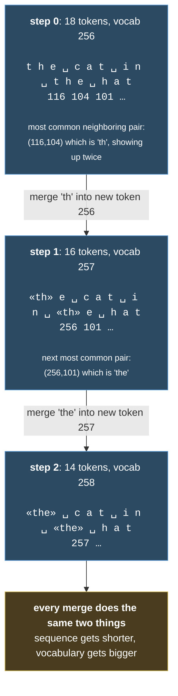

# CS336 Lecture 1: Overview and Tokenization

#cs336 #llm #tokenization #bpe

> Taught by Percy Liang. The lecture file is `lecture_01.py` in `stanford-cs336/spring2025-lectures`. Assignment 1 lives in `stanford-cs336/assignment1-basics`.
>
> Fun detail: the lectures are real Python programs. Percy runs the file and steps through it while he talks, so the slides literally execute.

Next one up: [[2. Resource Accounting]]

***

## Why build this stuff yourself

Here's the worry that got this course started.

Over the last decade, researchers have quietly drifted away from the machinery. Ten years ago you wrote your model and trained it. Around 2018 you downloaded BERT and finetuned it. Today you mostly just prompt something and move on.

Nothing wrong with prompting, by the way. You can do incredible things with it, and moving up the abstraction ladder is usually good. But abstractions leak. Sooner or later you're sitting there trying to make a model do something, it just won't, and you've got no idea why and nowhere to go. If you want to do real research, you need to be able to open the hood.

So the plan is blunt. Build it, and you'll understand it.

### The catch: we can't touch the frontier

GPT 4 reportedly cost something like a hundred million dollars back in 2023. People guess current runs are closer to a billion. And nobody publishes the details anymore. The GPT 4 paper says outright that it won't describe the architecture, the data, or the training, citing competition and safety.

So we build small models instead. Just be careful, because a small model is not a tiny frontier model. Two ways that bites you:

1. **Where the compute goes shifts as you scale.** At small scale the MLP layers eat roughly 44% of your flops. At 175B it's more like 80%. You could spend weeks tuning attention on a small model and get absolutely nothing when you scale up.
2. **Some abilities just show up out of nowhere.** Certain few shot tasks sit flat at chance until you cross some threshold, then they suddenly work. If you only ever work small, you'll never see the phenomenon at all.

### So what actually carries over

Percy splits knowledge into three buckets, and the split is genuinely useful:

**Mechanics.** What a Transformer is, how parallelism works, how kernels work. This transfers completely, because you can derive it.

**Mindset.** Squeeze your hardware. Profile everything. Take scaling seriously. Transfers too.

**Intuitions.** Which architecture tweaks and data choices actually help. This one does *not* reliably transfer. You need real scale and a lot of experiments.

That last bucket is more honest than people usually admit. There's a well known paper introducing the SwiGLU activation where the conclusion basically says: we have no explanation for why this works, and we credit divine benevolence. That's the actual conclusion of a real paper. Some of this stuff is pure "we tried it and it worked."

### The bitter lesson, read properly

Lots of people get this backwards.

Wrong version: scale is everything, algorithms don't matter.

Right version: **algorithms that scale are what matter.**

Think of it this way:

```
accuracy ≈ efficiency × resources        (efficiency = output / input)
```

Efficiency gets *more* important as you grow, not less. On a small run, a 2x slowdown just means you go get lunch and come back. On a frontier run, it's hundreds of millions of dollars. Even 5% is a real number. OpenAI measured a 44x algorithmic efficiency gain on ImageNet between 2012 and 2019, and that's on top of hardware getting better. The two multiply.

So the question behind the whole course is: **what's the best model you can build with a fixed data and compute budget?** For pretraining we're usually compute bound, since data feels plentiful. That could flip someday.

***

## A quick history

* **Shannon, back in the 1950s.** Used language models to measure the entropy of English.
* **The N gram era.** These weren't the whole system, they were a piece inside machine translation and speech recognition that kept the output sounding fluent.
* **The neural line.** LSTMs in the 90s. Bengio's first neural language model in 2003, which was just a feedforward net looking at a small context window. Then seq2seq, which boldly claimed you could squash a whole sentence into one vector. Then Adam, then attention (built for translation), then the Transformer (also built for translation), then mixture of experts and model parallelism through the 2010s.
* **Late 2010s.** ELMo and BERT. Pretrain on piles of text, then finetune for your task, and watch the numbers jump. Google had work around then that foreshadowed the "prompt in, response out" framing.
* **OpenAI opens the floodgates** by taking scaling seriously. GPT, then GPT 2, then they work out scaling laws, which lets them train GPT 3. More than 10x bigger than anything at the time, and in context learning falls out of it.
* **Google responds** with a big model that turned out to be undertrained. Meanwhile DeepMind, still separate at the time, had figured out compute optimal scaling.
* **Everyone tries to replicate GPT 3.** EleutherAI does grassroots open data and models, limited by compute. Meta ships a 175B model that you can tell is a replication attempt, and it hits a lot of hardware trouble and isn't great. Hugging Face runs BigScience. All fairly weak.
* **The last three years changed things.** Open weights caught up. Llama, then Llama 2 and 3. Mistral. Then a wave from the Chinese labs, DeepSeek and Qwen being the famous ones, with more appearing faster than anyone can track. Depending on who you ask, these are either a bit behind closed models or basically comparable, and they're genuinely used in industry.
* **Fully open efforts** go further than weights: AI2, NVIDIA, and Marin (Percy's project) publish the paper, the code, and the data too.

Why does Percy keep hammering on the open ecosystem? Because this course wouldn't exist without it. The papers still coming out about big mixture of experts models and RL systems are the only way we get to peek at how frontier models are actually built. Plenty is still missing (the data mixture is the usual secret), but it beats nothing by a mile.

### What "a language model" even means keeps changing

You used to finetune it. Then you prompted it. Then ChatGPT showed up and you talked to it. Now we're in the agent era, where you hand it a page of text and it goes off and does some complicated multi step coding job. What we ask of these things now would've sounded absurd ten years ago.

And yet the fundamentals barely moved. Still GPUs and kernels. Still gradient descent and friends. Still Transformers and attention. What changed is the spec sheet: we want way longer context now, which makes inference efficiency matter enormously.

***

## What the course covers

Five units, five assignments.

1. **Basics.** Build and train a language model from scratch.
2. **Systems.** Get everything you can out of the hardware.
3. **Scaling laws.** Decide what to train *before* you spend the money.
4. **Data.** Figure out what to feed it.
5. **Alignment.** Improve it with weak supervision.

### Assignment 1: basics

You write the tokenizer, the Transformer, the loss, the optimizer, and the whole training step. Plus resource accounting, so you know exactly where every flop went. You train on TinyStories and OpenWebText, and there's a leaderboard for driving perplexity down fast, sort of in the spirit of the NanoGPT speedruns.

The thing tying all of A1 together is a three way balancing act:

* **Expressivity.** The model has to be rich enough to capture the data.
* **Stability.** Keep your parameter and gradient norms in the goldilocks zone so nothing explodes or vanishes. Honestly, a huge fraction of training a language model is just fighting for stability.
* **Efficiency.** Make it run fast on the hardware you have.

Most architecture decisions boil down to "we can make this cheaper by projecting into a smaller space, but does it still work?" Making that call is the whole game.

Things that have evolved since the original Transformer: activation functions, positional encodings, where you normalize, and a pile of ways to avoid full attention (attention is quadratic in sequence length, and that gets expensive fast). If you're feeling adventurous there's the state space model and linear attention family, things like Mamba and Gated DeltaNet, and hybrids of those with regular attention seem to work nicely. The original Transformer used a dense MLP, and mixture of experts has now taken over as the way to get compute efficient models.

Then there's the shape question. How many layers, how many heads, what hidden dimension, how many experts. Sounds like boring hyperparameter fiddling. It isn't, once scale is involved.

On the training side: next token prediction is the default, but predicting several tokens ahead seems to help. AdamW used to be the answer, and Muon is showing up more, including in recent open models like Kimi K2. Then initialization, which sounds dull but has a big effect on whether large runs stay stable, plus learning rate schedule, regularization, batch size, and mixture of experts specific tricks.

Looking at that list you might think "fine, those are hyperparameters, I'll try a few." But setting them carefully is genuinely the difference between a run that blows up and a run that's the best thing out there.

### Assignment 2: systems

Resource accounting first, including where the 6ND flops formula comes from. Then the hardware picture, roofline analysis for telling memory bound work from compute bound work, and benchmarking and profiling.

The mental image to hold onto: **your memory is not where your compute is.** You ship parameters and activations from memory to the compute cores, do the math, and ship results back. That movement is usually the bottleneck. A B200 does about 2.25 petaflops per second in bf16 against roughly 8 terabytes per second of memory bandwidth.

Then kernels. A kernel is just a function that runs on the GPU. Every PyTorch primitive is already launching one, so you're using kernels whether you realize it or not. Sometimes you can write a better one, and the guiding principle is always the same: arrange the compute so you move as little data as possible. That's where fusion comes from (read once, do both operations, write once, instead of a round trip per step) and tiling, which is the fancier version of the same idea.

Scale it to thousands of GPUs and the principle doesn't change, it just gets more expensive, because moving data *between* GPUs costs even more. You get the classic collective operations (gather, reduce, all reduce), and then the orchestration problem: your parameters, activations, gradients, and optimizer states all have to be split across machines, and the right data has to show up in the right place at the right time. You can shard by data, by model, by layer, by sequence, or by expert, and each has tradeoffs. A DGX B200 is 8 GPUs on NVLink, and you connect boxes together over InfiniBand or ethernet.

Finally inference, which matters more every year. You need it for chatting, obviously, but also for RL rollouts, test time compute, generating synthetic data, and evaluation. It has two phases. **Prefill** pushes the whole prompt through at once and builds up key value pairs, which looks a lot like training. **Decode** generates one token at a time, and it goes memory bound almost immediately. That's the reason inference is hard.

Ways to speed it up: use a cheaper model (prune, quantize, distill), or try speculative decoding, where a small fast model guesses a run of tokens and the big model checks them all in parallel and accepts the ones it likes. Plus inference specific kernels, and batching, which is its own puzzle because requests arrive whenever they feel like it. In training you decided the batches in advance and everything was predictable.

Worth reading: *How to Scale Your Model*, from some Google folks. It's excellent on roofline analysis and Transformer math. It's TPU flavored, but the concepts carry, and there's a GPU chapter now.

### Assignment 3: scaling laws

Picture this. Someone hands you 1e25 flops, which is tens of millions of dollars. What do you train?

It's terrifying, because you get exactly one shot. You can't sweep hyperparameters at that scale. And if you get it wrong, that money is simply gone.

The mental shift is this: **stop thinking about training a model, and start thinking about a scaling recipe.** A recipe maps a flop budget to a config. You run a bunch of cheap small experiments, fit a scaling law, and use it to predict the loss you'd get at the target scale. That buys you two things. You can tune the recipe cheaply, and you can predict your result before spending anything, which is also how you go raise the money in the first place.

One thing people get wrong: **scaling laws are not laws of nature.** They don't happen on their own. You have to will them into existence by building the recipe carefully, and the recipe has to actually extrapolate. Does the learning rate stay constant as you grow? Does it drop? How fast does batch size climb?

That leads to hyperparameter transfer, which means parameterizing your model so the hyperparameters you found at small scale either carry over directly or move in some predictable way. Otherwise you're just guessing at the learning rate when it counts. Which leads to the line worth writing on your wall: **predictability matters at least as much as optimality.** Sure, you want the optimal thing. You want the unsurprising thing more.

The actual laws are the classic ones. For each flop budget, sweep model sizes, take the best point, fit a curve. That's Kaplan, and then the Chinchilla work. The rule of thumb that comes out is roughly **20 tokens per parameter**, so a 70B model wants about 1.4 trillion tokens. It shifts with your data and architecture. And if your points land on a clean line you can trust the extrapolation. If they're scattered everywhere, you've learned that you can't.

One caveat: Chinchilla ignores inference cost entirely. Plenty of modern models are deliberately smaller and trained way past the compute optimal point, because you'd rather serve something cheap.

The Marin project pre registers its predictions publicly before doing the big run, which is a nice bit of scientific honesty.

The assignment itself is fun, or at least Percy insists it's fun. You get a fake training API backed by a cache of models they trained ahead of time. You submit configs, you get losses back, and it feels like training. You fit scaling laws to your points, extrapolate, and get graded on where your final model actually lands. It simulates the hundred million dollar decision without the hundred million dollars.

### Assignment 4: data

**Data quality basically decides how good your model is.** Another way to say it: your data *is* the specification. Want it to speak several languages? Hold a conversation? Grind through long agentic coding tasks? That's a data question.

So you start with evaluation, because that's what defines the capability you're aiming at. And evaluation is deeper than "run some benchmarks."

There are internal metrics, for model development. Those need to be smooth across scales, since you want predictability, and what you care about is relative performance. A perplexity of 1.2 on some held out set doesn't mean anything on its own. Then there are external metrics, the ones you show customers or reviewers, where what matters is whether the eval resembles the real thing. People conflate these two constantly, and they're doing genuinely different jobs. Perplexity, for what it's worth, is still a great measure of a model's raw quality for internal purposes.

Try to evaluate on data that isn't already on the internet, or contamination will bite you. And use lots of different evals. You can average them into one number, but that average hides a lot.

Then you go get the data, and **data does not fall from the sky.** In a class or a research project someone usually just hands you a dataset. Not here. You crawl web pages, and there are books (legally messy now), arXiv papers, GitHub code. There are real legal questions: is training on copyrighted material fair use, do you need to license things, and what do you do with the enormous pile of GitHub code that has no license at all? Assume it's permissive, or play it safe?

Also, the data isn't text yet. It's HTML and PDFs and directory trees. So the pipeline goes: transform it into text, filter out the junk (a random terrible Common Crawl page is not worth your gradient steps), deduplicate, then figure out how to mix your sources. Increasingly people also generate synthetic data, which can mean taking real text and rewriting it into something closer to what you actually want.

Data shows up in stages too. Pretraining, then mid training, which is the high quality stuff you save for the end, often including long context material like big code repositories and books, and then post training data, which is conversations and agent traces with tool calls.

For A4 you start from a raw web crawl and do all the filtering and deduping yourself. Percy is upfront that this is the dirty work. It's also the part of building a model from scratch that people skip, so you're getting the real experience.

### Assignment 5: alignment

Everything up to now was full supervision: predict the next token, you know the answer, done. Alignment adds weak supervision, and the reason it works is simple. **Judging something is easier than producing it.**

You can't always write down the right answer to a prompt. You can usually say which of two answers is better. So the template is: generate responses, score them somehow (a human, a verifier, another model acting as judge), and nudge the model toward the ones that scored well. That shows up as PPO or GRPO, or as DPO when you have preference data.

The honest warning: RL is unstable and a pain to tune. Percy's advice is to stay in the supervised world as long as you possibly can. Some people enjoy RL anyway.

And once you do RL at scale it becomes a systems problem more than an algorithms problem. You've got an inference server generating rollouts and a training server consuming them, and if your environments involve running code it turns into a whole orchestration mess. Workers fall behind, so your data drifts off policy, and you spend your life trading how on policy you are against how much throughput you're getting.

### The thread running through all of it

Fixed resources go in (data, compute, memory, bandwidth) and you want the best model out. Look at each unit through that lens and it clicks:

* Systems is compute efficiency, obviously.
* Tokenization is compute efficiency too. Raw bytes would work fine if compute were free.
* Architecture changes mostly cut memory or flops, and these days a lot of them are driven by inference cost.
* Data filtering is efficiency, because with a fixed budget every step spent on garbage is a step not spent on something good.
* Scaling laws are how you do your hyperparameter tuning on cheap small models instead of expensive big ones.

Tomorrow we might be data constrained instead of compute constrained, and then the math changes. The mindset stays.

***

# The actual topic: tokenization

Karpathy has a really good video on this if you want another pass at it.

## The problem in one breath

Text is Unicode strings. A language model puts a probability distribution over sequences of integers. Somebody has to translate between those two worlds, in both directions.

```python
class Tokenizer(ABC):
    def encode(self, string: str) -> list[int]: ...
    def decode(self, indices: list[int]) -> str: ...
```



**The rule that can't break: `decode(encode(s))` has to give you back exactly `s`.** If your tokenizer doesn't round trip, it's broken, full stop.

All a tokenizer really does is chop text into pieces.

## Compression ratio, the number that matters

```
compression ratio = (# bytes) / (# tokens)     "bytes per token"
```

In the lecture, a 20 byte string became 8 tokens, so 2.5 bytes per token.

Bigger is better, because attention is quadratic in sequence length and shorter sequences are cheaper. And you can always push it up by growing the vocabulary.

But you can't just grow it forever. Every vocabulary entry is treated as its own separate symbol, so a huge vocabulary means most entries show up rarely and the model barely learns them. That's the sparsity problem. Modern tokenizers, especially multilingual ones, land somewhere around 100k to 200k tokens.

**That's the whole tension: vocabulary size against sequence length.**

## Why tokenizers are so annoying

Go poke at a tokenizer playground and you'll notice things that feel wrong:

A word on its own and the same word with a space in front are **completely different tokens**. So a big chunk of any vocabulary is entries that start with a space. `"hello"` and `" hello"` share nothing. They're just two unrelated integers as far as the model is concerned.

Numbers get chopped a few digits at a time, sometimes predictably and sometimes not. Some tokenizers force one digit per token to keep it sane, but then your sequences get longer. Tradeoffs everywhere.

## Four ways to do it, three of which are bad

They're all the same tension viewed from different corners, and only one corner is livable:



### 1. One token per character

Use Unicode code points. `ord()` one way, `chr()` back.

There are about 150k Unicode characters, so that's your vocabulary. Which isn't insane on its own, but most of those characters are vanishingly rare, so you're spending your whole vocabulary budget on things you'll never see. And the compression ratio is poor, so sequences stay long. Bad on both counts.

### 2. One token per byte

Encode to UTF 8 and use the raw bytes. Now every value is between 0 and 255. Some characters take one byte, others take several.

The vocabulary is tiny and you can *never* be stuck, since anything can be written as bytes. Lovely.

But the compression ratio is exactly 1.0, by definition. You're spelling out every single thing letter by letter, and your sequences blow straight past the context window. Useless in practice.

### 3. One token per word

Split on spaces or a regex, call each chunk a token. This is what people actually did in NLP for years.

The nice part is that tokens mean something. Humans invented words, and words have reasonably stable meanings, so each token carries real signal. The compression ratio is good too.

The fatal part: your vocabulary is however many distinct chunks appeared in your training data. That's huge. Worse, it's effectively **unbounded**, because at test time somebody will hand you a word you've never seen. The old fix was an `UNK` token, which is ugly and quietly wrecks your perplexity numbers.

### 4. Byte pair encoding, which is the one we use

BPE started life as a data compression algorithm back in 1994, long before anybody was doing this with language models. It got pulled into NLP for machine translation, and GPT 2 was the first big language model to use it.

Here's the idea, and it's genuinely simple: **train the tokenizer on your actual text** so the vocabulary fits the data you have. Sequences you see constantly become a single token. Rare sequences get broken into smaller pieces. And because you can always fall back to raw bytes, **you never need an `UNK` token again.**

Think of it like inventing your own shorthand. Write "the" ten thousand times and eventually you'd just make up a squiggle for it. Write some bizarre word once and you'll spell it out. That's the whole algorithm.

## How you actually train it

1. Start with your corpus as bytes. Every byte is a token, so you begin with 256 of them.
2. Count every pair of neighboring tokens.
3. Find the pair that shows up most.
4. Merge it. Give it a fresh index (`256 + i`), record what it's made of, and replace every occurrence in the sequence.
5. Repeat however many times you want.

```python
def train_bpe(string: str, num_merges: int) -> BPETokenizerParams:
    indices = list(map(int, string.encode("utf-8")))
    merges: dict[tuple[int, int], int] = {}          # pair to new index
    vocab: dict[int, bytes] = {x: bytes([x]) for x in range(256)}

    for i in range(num_merges):
        counts = defaultdict(int)
        for a, b in zip(indices, indices[1:]):       # every neighboring pair
            counts[(a, b)] += 1

        pair = max(counts, key=counts.get)           # the most common one
        new_index = 256 + i
        merges[pair] = new_index
        vocab[new_index] = vocab[pair[0]] + vocab[pair[1]]
        indices = merge(indices, pair, new_index)    # swap it in everywhere

    return BPETokenizerParams(vocab=vocab, merges=merges)
```

`BPETokenizerParams` holds two things and nothing else: `vocab`, mapping an index to bytes, and `merges`, mapping a pair to the index it became.

### Watching it run on "the cat in the hat"



In the toy example the compression ratio ends up around 1.5. Real corpora do much better, obviously.

### Encoding something new

Take the merges you learned, in order, and apply them to the byte sequence. Decoding is even easier: look up each index and glue the bytes together. And it has to come back exactly as it went in.

## What A1 makes you fix

The version above works. It's also painfully slow, and that's deliberate. Your job:

* **`encode` currently loops over every single merge**, and there are `vocab_size` minus 256 of them. You only want to touch merges that actually apply, which means building some indexing over where the pairs live.
* **Special tokens.** Not conceptually deep, but you can't ship a real tokenizer without them.
* **Pre tokenization.** Don't run BPE across the whole string. Chop the text into chunks first (GPT 2 uses a regex for this), then tokenize each chunk. Way faster, and it also stops merges from spilling across word boundaries, which you don't want.
* Eventually you'll notice Python is just slow. If you want to rewrite it in Rust or C, go for it.

## Wrapping up

* Tokenizers move between strings and integers, and they have to round trip.
* Character, byte, and word level each fail in their own way. Vocabulary too big, sequences too long, or a vocabulary that has no upper bound.
* **BPE is a heuristic that learns from your data.** That's honestly all it is, and it works well.
* Percy says he hopes every year that he won't have to teach this. The dream is going straight from raw bytes with no tokenizer at all, and there's promising work in that direction, but nothing tokenizer free has been scaled to the frontier yet. So here we are.

### Whatever eventually replaces it still has to do two things

1. **Give the Transformer some abstraction over the sequence**, not raw units. This is clearest with video or DNA, where a single byte carries almost no signal, so you have to lift things into a space where modeling is even possible.
2. **Use variable sized chunks, so compute can adapt.** Not every byte deserves the same attention. A long boring stretch should collapse into one token while the rare interesting bits stay spread out. Skip this and you're leaving efficiency on the table.

***

## Things to chase down

* [ ] Derive the 6ND flops formula myself (that's lecture 2)
* [ ] Read *How to Scale Your Model* for the roofline and Transformer math
* [ ] Play with a tokenizer playground, check the leading space thing and how digits get chopped
* [ ] A1: write BPE, then profile it and make `encode` fast
* [ ] Look up: the SwiGLU paper, hyperparameter transfer, Chinchilla, byte level end to end models

## Related notes

[[2. Resource Accounting]] · [[3. Architectures]] · [[Scaling Laws]] · [[BPE Implementation Notes]]
