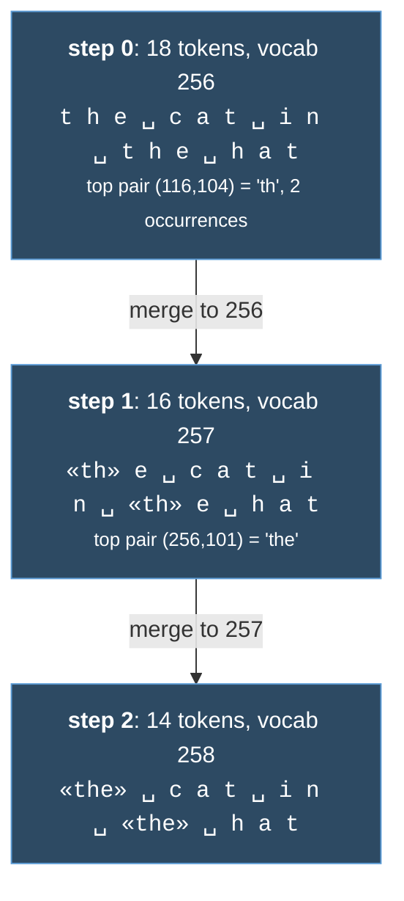

# Tokenization

#cs336 #tokenization #bpe

CS336 Lecture 1 · [[2. Resource Accounting]] · [[3. Architectures]]

***

## Definition

```python
class Tokenizer(ABC):
    def encode(self, string: str) -> list[int]: ...
    def decode(self, indices: list[int]) -> str: ...
```

**Invariant: `decode(encode(s)) == s`.** No round trip, broken tokenizer.

A tokenizer is a segmentation of text. It converts Unicode strings into the integer sequences a model puts a distribution over.

![[cs336_l1_encode_decode.png]]

Worth staring at the colored strip for a second, because it previews three things this note comes back to later. `Stanford` is one word to you but **two tokens**, `Stan` and `ford`, since the merges never made the whole thing frequent enough. Every token after the first carries its **leading space** inside it, so ` was` is the token, not `was`. And `1885.` gets chopped into pieces that follow no rule you would have guessed. Nothing here is a bug. It all falls out of training the segmentation on a corpus.

## Compression ratio: the governing metric

```
compression ratio = bytes / tokens        ("bytes per token")
```

* Higher is better. Shorter sequences, and attention costs quadratic in length.
* You can always raise it by growing the vocabulary.
* But every vocab entry is a distinct symbol. Big vocab means each entry is seen rarely, so the model barely learns it. **That is the sparsity cost.**

> **The central tension: vocabulary size against sequence length.** Modern tokenizers, especially multilingual, land at 100k to 200k tokens.

## The four designs

| approach | vocab | ratio | verdict |
|---|---|---|---|
| character (Unicode code points) | ~150k | poor | vocab spent on rare chars, sequences still long |
| byte (UTF 8) | 256 | **exactly 1.0** | never OOV, but blows past the context window |
| word (regex split) | unbounded | good | needs `UNK`, which corrupts perplexity |
| **BPE** | ~100k, learned | good | ✅ what everyone uses |

Why each of the three fails, in one line:

* **Character.** ~150k possible characters, most vanishingly rare. Wastes the vocabulary budget and still gives long sequences.
* **Byte.** Ratio is 1.0 by definition, so sequences are enormous. Tiny vocab and never stuck, but unusable.
* **Word.** Tokens carry real meaning and the ratio is fine, but vocab equals distinct chunks in training data, which is effectively **unbounded**. Test time always brings an unseen word.

## BPE

Origin: 1994 data compression algorithm. Pulled into NLP for machine translation. First LM use was GPT 2.

**Idea: train the tokenizer on the corpus.** Frequent sequences collapse to one token, rare ones split into smaller pieces. Since you can always fall back to bytes, **`UNK` never happens.**

### Training algorithm

1. Corpus as bytes. Every byte is a token, so vocab starts at 256.
2. Count all adjacent pairs.
3. Take the most frequent pair.
4. Merge: allocate index `256 + i`, record it, replace every occurrence.
5. Repeat `num_merges` times.

```python
def train_bpe(string: str, num_merges: int) -> BPETokenizerParams:
    indices = list(map(int, string.encode("utf-8")))
    merges: dict[tuple[int, int], int] = {}
    vocab: dict[int, bytes] = {x: bytes([x]) for x in range(256)}

    for i in range(num_merges):
        counts = defaultdict(int)
        for a, b in zip(indices, indices[1:]):
            counts[(a, b)] += 1

        pair = max(counts, key=counts.get)
        new_index = 256 + i
        merges[pair] = new_index
        vocab[new_index] = vocab[pair[0]] + vocab[pair[1]]
        indices = merge(indices, pair, new_index)

    return BPETokenizerParams(vocab=vocab, merges=merges)
```

`BPETokenizerParams` stores exactly two things: `vocab` (index to bytes) and `merges` (pair to index).

### Worked example



**Every merge: sequence shorter, vocabulary bigger.**

### Encoding and decoding

* **Encode:** apply the learned merges, in order, to the byte sequence.
* **Decode:** look up each index, concatenate the bytes.

## A1: making it fast

The reference implementation above is correct and very slow. What to fix:

| problem | fix |
|---|---|
| `encode` loops over every merge (`vocab_size` minus 256 of them) | index the pair positions, touch only merges that apply |
| BPE run across the whole string | **pre tokenize**: split into chunks first (GPT 2 uses a regex), tokenize each |
| Python is slow | port the hot loop to Rust or C |
| no special token handling | required for a real tokenizer, shallow but necessary |

Pre tokenization has a second benefit beyond speed: it **stops merges from crossing word boundaries.**

## Practical quirks

* `"hello"` and `" hello"` are **different, unrelated tokens.** Much of any vocabulary is entries with a leading space.
* Digits get chunked a few at a time, sometimes unpredictably. Forcing one digit per token is cleaner but lengthens sequences.

## Why tokenizers still exist

Nothing tokenizer free has been scaled to the frontier yet. Any replacement still has to provide:

1. **An abstraction over the sequence**, not raw units. Clearest for video or DNA, where a single byte carries almost no signal.
2. **Variable length chunks, so compute can adapt.** A long predictable stretch should collapse to one token while rare content stays expanded.

***

## Course context (lecture 1 first half)

Compressed, since it is orientation rather than reference.

**Why build from scratch.** Abstractions leak. Prompting gives you no recourse when a model will not do something, and research needs the whole stack. The GPT 4 technical report is the clean illustration of how little the frontier tells you:

![[cs336_l1_gpt4_no_details.png]]

**Small models are not tiny frontier models.** Two concrete failures of transfer:
* Flop distribution shifts. MLP layers are ~44% of flops at small scale, ~80% at 175B.
* Emergence. Some few shot abilities sit at chance until a threshold, then work.

![[cs336_l1_flop_split_by_scale.png]]

Read the FFN column down: 44% at 760M climbing to 80% at 175B. The other columns move just as hard in the other direction. Attention falls from 14.8% to 3.3%, and the logit layer nearly vanishes, 5.8% down to 0.3%. So an optimization that wins big on attention at 760M is close to pointless at 175B, and the reverse for anything touching the MLP. **This is why intuitions do not transfer.**

![[cs336_l1_emergence.png]]

And the sharper version of the same problem. Below the threshold the curve is flat at chance, which tells you nothing about whether the ability exists above it.

Some decisions have no theory at all behind them yet. The SwiGLU paper is refreshingly honest about this:

![[cs336_l1_divine_benevolence.png]]

**What transfers:**

| knowledge | transfers? |
|---|---|
| mechanics (what a Transformer is, parallelism, kernels) | yes, derivable |
| mindset (profile everything, take scaling seriously) | yes |
| intuitions (which tweaks actually help) | no, needs scale and experiments |

**The bitter lesson, correctly.** Not "scale is all that matters." It is **"algorithms that scale are what matter."**

```
accuracy ≈ efficiency × resources
```

Efficiency matters more as scale grows, since a 2x slowdown is lunch at small scale and hundreds of millions at frontier scale. OpenAI measured 44x algorithmic efficiency gain on ImageNet from 2012 to 2019, on top of hardware gains. The two multiply.

**Course question:** best model achievable given a fixed data and compute budget.

**Five units:** basics, systems, scaling laws, data, alignment.

***

## Open

* [ ] Implement BPE, then profile and fix `encode`
* [ ] Compare two tokenizer vocabs on the same string, check leading space and digit behavior
