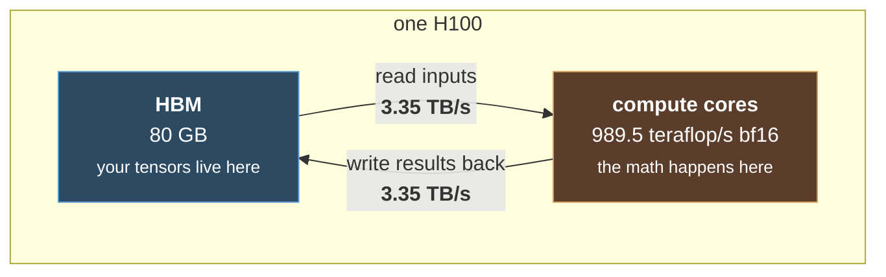
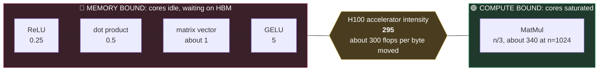
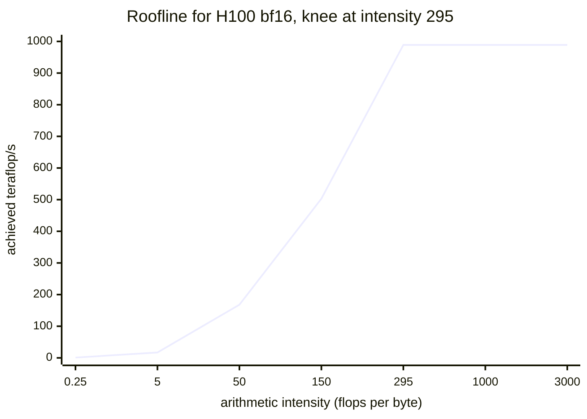
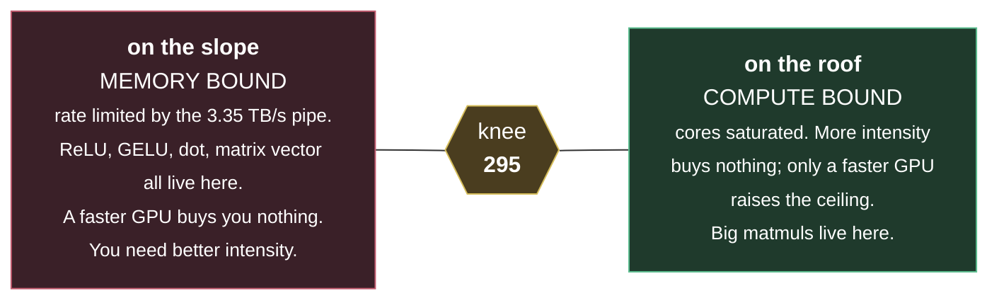
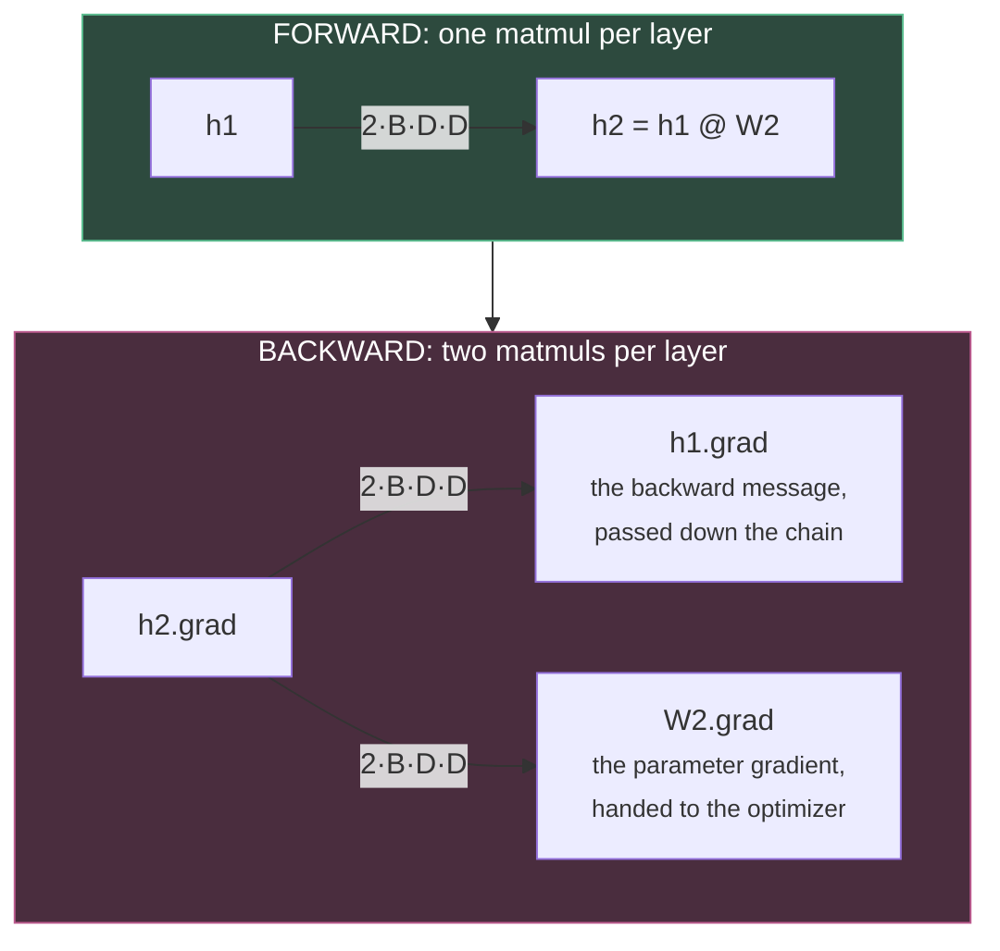

# CS336 Lecture 2: PyTorch and Resource Accounting

#cs336 #llm #pytorch #systems #flops #memory #einops

> Taught by Percy Liang. The lecture file is `lecture_02.py` in `stanford-cs336/spring2025-lectures`.
>
> Before this: [[1. Tokenization]] · After this: [[3. Architectures]], taught by Tatsu

There's no machine learning magic in this one. It's mechanics, meaning how PyTorch and tensors actually behave, plus a single habit Percy wants to drill into you: **every time you write a line of tensor code, think about what it costs.**

***

## Quick follow up from last time

That 1e23 flop Marin run finished, and it **landed within 0.05 of the predicted loss.**

The way they got there: run a family of IsoFLOP curves, where each curve is a sweep of smaller runs at one fixed compute budget. Find the compute optimal point on each. Fit a scaling law through those points. Extrapolate. More on this in [[Scaling Laws]].

***

## Two questions worth being able to answer cold

These are the flavor of thing you should be able to work out on a napkin by the end of the course. The point isn't precision. It's knowing roughly what shape the answer has.

### How long to train 70B parameters on 15T tokens with 1024 H100s?

```
flops needed  = 6 × params × tokens = 6 × 70e9 × 15e12  = 6.3e24
hardware rate = 1024 × 989.5e12 × MFU of 0.5           ≈ 5.1e17 flop/s
time          = 6.3e24 / 5.1e17 ≈ 1.24e7 seconds       ≈ 143 days
```

### What's the biggest model you can train on 8 H100s with AdamW?

```
memory you have  = 8 × 80 GB = 640 GB
bytes per param  = 2 (bf16 param) + 2 (bf16 grad) + 4 + 4 (fp32 Adam moments) = 12
params you fit   = 640e9 / 12 ≈ 53B
```

Fair warning on that second one: it ignores activations completely, and those depend on your batch size and sequence length. It's a ballpark, not a promise.

***

## Tensors, and how many bits you spend on them

**Everything is a tensor.** Your parameters, gradients, optimizer states, data, activations. All of it. Open up any released model and it's just a list of tensors, each with a shape and a dtype.

Memory is the boring part:

```
memory = number of elements × bytes per element
```

A 4 by 8 matrix in fp32 is 32 elements times 4 bytes, so 128 bytes. For scale, one feedforward matrix inside GPT 3 is about 2.3 GB, and GPT 3 is an old model now. These things get big.

### The float formats, and why we keep shrinking them

The two numbers that matter for any float format are how many bits go to the **exponent**, which buys you dynamic range, and how many go to the **mantissa**, which buys you resolution.

* **fp64**, double precision, 1 sign bit plus 11 exponent plus 52 mantissa. This is scientific computing territory.
* **fp32**, single precision, 1 plus 8 plus 23. PyTorch's default. The name comes from the old scientific computing world, where if somebody handed you a float you'd assume at least this much.
* **fp16**, 1 plus 5 plus 10. Only 5 exponent bits, and that's the problem.
* **bf16**, 1 plus 8 plus 7. Invented in 2018 specifically to fix fp16.
* **fp8**, two flavors on H100 (E4M3 and E5M2), because sometimes you want range and sometimes resolution.
* **nvfp4**, four bits, rescued by block scaling.

Blue is exponent, so that's range. Orange is mantissa, so that's resolution. Look at how bf16 keeps every exponent bit that fp32 had and pays for it out of the mantissa:

```mermaid
flowchart LR
    subgraph f32 ["fp32 · 32 bits · full range, full resolution"]
        direction LR
        A1["S"] --- A2["exponent · 8 bits"] --- A3["mantissa · 23 bits"]
    end
    subgraph f16 ["fp16 · 16 bits · range collapses, you get NaNs"]
        direction LR
        B1["S"] --- B2["exp · 5"] --- B3["mantissa · 10 bits"]
    end
    subgraph bf ["bf16 · 16 bits · fp32's range, coarser steps"]
        direction LR
        C1["S"] --- C2["exponent · 8 bits"] --- C3["mant · 7"]
    end
    f32 ~~~ f16 ~~~ bf

    style A2 fill:#2d4a63,stroke:#5b9bd5,color:#fff
    style C2 fill:#2d4a63,stroke:#5b9bd5,color:#fff
    style B2 fill:#63344a,stroke:#d55b8f,color:#fff
    style A3 fill:#5a3d2b,stroke:#d59b5b,color:#fff
    style B3 fill:#5a3d2b,stroke:#d59b5b,color:#fff
    style C3 fill:#5a3d2b,stroke:#d59b5b,color:#fff
```



Here's the thing people get wrong about fp16. **It fails on range, not on precision.** Try to make a tensor holding ten to the negative eight in fp16 and you get zero. It's just gone. Train in fp16 and you'll hit underflow, overflow, NaNs, and general misery. People did this back in the day and it was rough.

bf16 fixes it by shuffling bits from the mantissa over to the exponent. Same total width, same range as fp32, worse resolution. And that's a great deal for us, because deep learning is noisy and approximate anyway. You don't need the extra decimal places. You very much need to not overflow.

On nvfp4 and the block trick, since someone asked in class: within a block, each value gets its 4 bits of wiggle room, and then the entire block gets a shared scale factor on top. So any individual value effectively has more range than 4 bits would suggest. What you *can't* do is have one enormous value sitting next to a tiny one inside the same block. Nemotron 3 Super was actually trained this way, which is wild.

Somebody also asked about going down to 1 bit. Worth separating two different things here: quantizing a model you already trained in bf16 down to 1 or 2 bits is a very different job from *training* at that width. Nobody has trained anything credible at 1 bit. And honestly, a lot of the fp8 and fp4 story isn't something you touch directly. It happens down inside NVIDIA's stack.

### Mixed precision, which is what people actually do

The standard split:

* **bf16** for parameters, activations, and gradients.
* **fp32** for optimizer states.

PyTorch's AMP library handles this for you. You wrap your code and it casts things to bf16 where that's safe, which matrix multiplies are, and leaves things like exponentiation in fp32, which they need to be.

Rule of thumb: training something small and don't want to think about it? Just use fp32. Otherwise use bf16 mixed precision. Never plain fp16.

### Three separate reasons smaller floats are faster

1. Less memory to store, so bigger models fit.
2. Fewer bits to compute on. Roughly 2x per halving, though not always.
3. **Less memory to move around.** This is the sneaky one, and it turns out to be the big one. Whole section on it below.

One thing that trips everyone up at least once: tensors land on the CPU by default. Move them to the GPU or you'll wonder where your speedup went.

***

## einops, or: please name your dimensions

The motivation is that code like `x.transpose(-2, -1) @ y` is miserable. You sit there counting axes backwards trying to work out what you're even transposing. Use names instead of numbers. The library takes its inspiration from Einstein summation notation.

### einsum, a matrix multiply that keeps its own books

```python
z = einsum(x, y, "seq1 hidden, hidden seq2 -> seq1 seq2")
```

One rule covers the whole thing: **go through every named variable, multiply the indexed entries together, and sum away anything that doesn't appear on the right side.** Here `hidden` doesn't survive, so `hidden` gets summed out.

Now the batched version, and notice there's no transpose anywhere. The naming already did it:

```python
z = einsum(x, y, "batch seq1 hidden, batch seq2 hidden -> batch seq1 seq2")
z = einsum(x, y, "... seq1 hidden, ... seq2 hidden -> ... seq1 seq2")
```

That `...` earns its keep in language model code, where you're constantly juggling a batch dimension and a sequence dimension and a head dimension all at once, and you want the same operation to work no matter how many of them there are.

### reduce, which covers sum and mean and max and min

```python
y = reduce(x, "... hidden -> ...", "sum")
```

Same rule as before. Whatever dimension is missing from the output gets collapsed, using whichever operation you name.

### rearrange, for splitting and merging dimensions

You want this when one dimension is secretly two dimensions wearing a trenchcoat, which happens constantly with flattened head dimensions:

```python
x = rearrange(x, "... (heads hidden1) -> ... heads hidden1", heads=2)   # 8 becomes 2 by 4
x = einsum(x, w, "... hidden1, hidden1 hidden2 -> ... hidden2")
x = rearrange(x, "... heads hidden2 -> ... (heads hidden2)")            # put it back
```

You have to supply one of the sizes, since 8 could split as 2 by 4 or 4 by 2 and the library can't read your mind.

Somebody asked whether flattening two dimensions into one is ambiguous, row major versus column major. It isn't. The order you write inside the parentheses is the order you get.

And somebody asked whether einops is faster. It isn't. It's sugar, and it compiles down to the same primitives. The payoff is entirely in your head. Once you think in einsum, transposes and reductions stop being a thing you reason about and start being a thing you just write.

***

## Counting flops

### A small terminology gripe worth adopting

* **flops**, lowercase s, means floating point operations. A quantity of work. "GPT 3 took about 3e23 flops."
* **flop/s** means operations per second. A hardware speed. "An H100 does 989 teraflop/s."

Write the slash. `FLOPS` with a capital S is ambiguous and everyone abuses it constantly.

### The spec sheet will lie to you

NVIDIA advertises the H100 at **1979 teraflop/s** in bf16. Read the footnote and you'll find that's *with sparsity*. For dense math, **cut it in half, so 989.5 teraflop/s.** That's why you'll see a divide by 2 scattered all over this lecture.

For reference: an H100 does 67.5 teraflop/s in fp32 and 989.5 in bf16. An A100 does 19.5 and 312. Notice how bad fp32 looks now. Nobody optimizes that path anymore.

A number worth memorizing: 8 H100s, which is one node, running for one week, gives you roughly **5e21 flops.**

### The formula everything reduces to

For `x` of shape `(B, D)` times `w` of shape `(D, K)`:

```
flops = 2 · B · D · K
```

The 2 is one multiply plus one add per triple. Technically it's `D` minus 1 additions, not `D`, so you're slightly over counting. Ignore it.

Now rewrite it, because this rewriting is the entire point:

```
B is your data points, or tokens
D · K is your parameter count

so:  forward flops = 2 × tokens × parameters
```

You can already see 6ND forming out of the fog.

### Everything else is basically free

Elementwise operations cost about one flop per element. Nothing you'll run into is as expensive as a matrix multiply once the matrices get big, so for flop counting you can mostly just count matmuls. That changes completely when we start counting *memory* instead, which is the next section.

Two good questions from the room. On subcubic matrix multiply algorithms like Strassen: in practice the effort goes into co designing with the hardware, not chasing asymptotics. And on whether multiplication costs more than addition: intuitively it feels like it should, but the way the hardware is built they're about the same.

### Timing it honestly

```python
torch.cuda.synchronize()   # the GPU runs async, so without this your timings are fiction
t0 = time.time()
op()
torch.cuda.synchronize()   # and again afterward
```

Run it several times and average. Skip the synchronize and you're timing how long it takes to *launch* the work, not do it, and you'll get suspiciously wonderful numbers.

### MFU, which tells you if you're wasting the machine

```
MFU = actual flop/s ÷ promised flop/s
```

Promised means the already halved dense spec number. To get the actual number, count the logical flops your model needs, then divide by wall clock time.

How to read the result: around **0.8** is what a bare matmul with nothing else going on can hit. **0.5 or better on a real model** and you should feel good. **Around 0.1** means something is genuinely broken and you should go find it. And you never beat 1.0. You just don't.

***

## Arithmetic intensity, or why your MFU is stuck at 0.5

This is the heart of the lecture.

### The picture

Your data sits in **HBM**. Your math happens in the **compute cores**. Every single operation means shipping inputs up, doing the work, and shipping results back down.



**The whole lecture is about that arrow.** Those cores are absurdly fast compared to the pipe feeding them. So for most operations, the cores finish almost instantly and then sit there twiddling their thumbs waiting for the next batch of bytes.

Which means runtime depends on *two* hardware numbers, not one. Compute is 989.5e12 flop/s. Memory bandwidth is 3.35e12 bytes per second.

This is also the second reason to care about memory size. The obvious reason is that your model has to fit. The non obvious one is that **memory has to be moved, moving takes time, so how big your tensors are affects how fast you go.**

### The model, which is refreshingly simple

Assume communication and compute overlap perfectly, meaning you start computing the moment bytes land instead of waiting around:

```
time ≈ max(communication time, compute time)
communication time = bytes moved / bytes per second
compute time       = flops / flops per second
```

Real overlap is never perfect, but this is plenty good for napkin math.

If communication takes longer, you're **memory bound**, sitting around waiting for bits. If compute takes longer, you're **compute bound**, actually doing useful work.

### The two intensities

```
accelerator intensity = flop/s ÷ bytes/s     this is a property of your HARDWARE
arithmetic intensity  = flops ÷ bytes moved  this is a property of your ALGORITHM
```

For an H100 that's 989.5e12 divided by 3.35e12, which is about **295**.

Keep roughly 300 in your head. **An H100 can do about 300 floating point operations in the time it takes to move a single byte.** That number is the line everything gets measured against:

```
arithmetic intensity below accelerator intensity → memory bound
arithmetic intensity above accelerator intensity → compute bound
```

Which is just the time comparison from before with the fractions cross multiplied.

### Running the numbers on real operations

All in bf16, so 2 bytes per element.

**ReLU on n elements.** You read 2n bytes and write 2n bytes, so 4n moved. You do n comparisons. Intensity **0.25**. Memory bound, and not by a little.

**GELU on n elements.** Same 4n bytes moved. About 20n flops, since it's a much fancier formula. Intensity **5**. Still memory bound.

**Dot product of two length n vectors.** Read 2n, read another 2n, write 2 bytes. Roughly 2n flops. Intensity **about 0.5**. Memory bound.

**Matrix times vector, n by n.** Read 2n for the vector, 2n squared for the matrix, write 2n. You do n dot products, so 2n squared flops. Intensity **about 1**. Still memory bound, barely better than a plain dot product.

**Matrix times matrix, n by n.** You move 6n squared bytes total and do 2n cubed flops. Intensity **about n/3**, which at n equals 1024 is around 340. **Finally, compute bound.**

Everything on one axis, with 295 as the line that decides your fate:



### What that table is actually telling you

**GELU takes the same wall clock time as ReLU.** GELU does roughly twenty times the arithmetic, and it costs you nothing, because both are stuck waiting on memory either way. So if your gut says "GELU is the expensive one," your gut is wrong, and it's wrong for an interesting reason.

**Only matrix multiply escapes**, and only because you move n squared bytes to do n cubed work, so intensity climbs with n. This is the real reason everybody tells you to use big batches and big matrices. Below the line, making your matrices smaller doesn't speed anything up. It's all the same. Above the line, you're finally saturating the thing you paid for.

**Transformers are compute bound on purpose.** They're big matrix multiplies with a few odds and ends sprinkled between. The architecture was built to have high arithmetic intensity.

Looking ahead to the inference lecture: generating one token at a time is a **matrix vector** product, intensity about 1, so it's memory bound. Training pushes the whole sequence through at once, which is a matmul, so it's compute bound. **That gap is the core reason decoding is hard.**

Intensity also shifts with precision, since fewer bytes per element changes the ratio.

And this finally answers the MFU question from earlier. The promised flop/s assumes you're doing nothing but arithmetic forever. Every memory bound stretch of your model is time the cores spend idle, and that's exactly where your MFU leaks away.

### The roofline plot

Each point is `min(peak, intensity × bandwidth)`. The line climbs at 3.35 TB/s until it smacks into the 989 teraflop/s ceiling:





A faster GPU raises the roof. Faster memory rotates the slope. **So if your workload is sitting on the slope, buying a better GPU does absolutely nothing for you.**

Great question from the room that nobody resolved: why are accelerators built so lopsided in the first place, with all that compute idling while it waits on memory? Percy's answer was to come back to it after the GPU lecture, and then, if you've got a good answer, go tell Jensen.

***

## What training actually costs in compute

### The setup

Input of shape `(B, D)`, then `L` layers, each one a `(D, D)` matrix multiply followed by an elementwise ReLU. So the parameter count is `D² · L`.

### The backward pass costs twice the forward pass

Take one layer, `h2 = einsum(h1, w2, "batch in, in out -> batch out")`.

Forward is one matmul, so `2 · B · D · D`.

Backward has to produce **two** different gradients:

```python
# 1. the backward message, dL/dh1, which gets passed down the chain
h1_grad = einsum(h2_grad, w2, "batch out, in out -> batch in")

# 2. the parameter gradient, dL/dw2, which goes to the optimizer
w2_grad = einsum(h2_grad, h1, "batch out, batch in -> in out")
```

Both of these walk over the same three dimensions, `batch` and `in` and `out`. The only difference is which one gets summed away. So **each one costs exactly what the forward matmul cost.**



By the way, this is where einops really pays off. You never have to remember which of the two things gets transposed. Write out the named dimensions and the shapes force the right answer. Percy admits he gets it confused too.

### Which gives you 6ND

```
forward   = 2 × tokens × parameters
backward  = 4 × tokens × parameters      (two gradients per layer)
total     = 6 × tokens × parameters
```

**That's the whole mystery of 6ND. It's just counting forward and backward.**

One caveat worth remembering. This is a solid approximation for Transformers *as long as your context isn't too long*. Long context brings in a term that grows with the square of sequence length, and this accounting misses it entirely. A1 makes you do the careful version.

***

## What training costs in memory

Four things eat your memory. For the `D²L` network above, running bf16 with fp32 optimizer states:

* **Parameters.** `2 · D² · L` bytes, so 2 bytes each in bf16.
* **Activations.** `2 · B · D · L` bytes. Note that this one scales with **batch size**, which matters in a minute.
* **Gradients.** Same shape as the parameters, so another 2 bytes each.
* **Optimizer state.** In fp32, so 4 bytes per moment per parameter. SGD needs none. AdaGrad keeps one moment, so 4 bytes. Adam and AdamW keep two, so **8 bytes per parameter.**

Optimizer state ends up being a big slice of your total memory. But there's an asymmetry worth noticing. **Memory does two different jobs.** It has to fit in HBM, and it has to get shipped to the cores. Optimizer state isn't on the compute critical path, so its size doesn't really hurt your speed. It just caps how big a model you can hold.

Why fp32 for the optimizer states? People have tried bf16. You're squaring gradients and averaging them over thousands of steps, and it just isn't stable enough.

### The optimizer itself

Percy uses AdaGrad here, from 2011, partly so he isn't handing you assignment 1's answer. It sits between SGD and Adam. Momentum tracks the first moment of the gradient, AdaGrad tracks the second, and Adam does both.

Optimizer state is just scratch storage the optimizer keeps between steps. An AdaGrad step accumulates `g² += grad²` into that storage, then updates the parameter by dividing the gradient by the square root of it. A1 has you write AdamW yourself.

***

## Two ways to claw back memory

### Gradient accumulation

Bigger batches help stability, up to a critical batch size that Tatsu will get into later. But activation memory scales with batch size, so eventually you run out of room.

The fix is almost embarrassingly simple. Split the batch into **microbatches**. Compute gradients on each one and just **don't zero them**, so they pile up. Once you've done `batch size / microbatch size` of them, step the optimizer and clear the gradients.

Tiny code change. Same effective batch size. Way less activation memory.

### Activation checkpointing

Training stores the activations for every layer by default, which is `2 · B · D · L`, because backprop needs them on the way back. Inference doesn't, which is why it only needs the current layer's activations and has such a different memory profile.

The idea: during the forward pass, keep activations for only **some** layers. During the backward pass, **recompute** whatever's missing starting from the nearest one you kept. It's the classic systems trade, spending compute to buy back memory. You'll also see it called gradient checkpointing or rematerialization.

```python
torch.utils.checkpoint.checkpoint(block, x)   # don't save this block's intermediates
```

Wrap each linear plus ReLU block and you stop storing the pre ReLU tensor, which is about half your activation memory, and it's cheap to regenerate on the way back.

Nine layers below. Filled means you kept it. Hollow means you threw it away and will recompute it.

```mermaid
flowchart LR
    subgraph A ["store everything (the default): memory L, no recompute, fastest but OOMs first"]
        direction LR
        a1(("1")) --- a2(("2")) --- a3(("3")) --- a4(("4")) --- a5(("5")) --- a6(("6")) --- a7(("7")) --- a8(("8")) --- a9(("9"))
    end
    subgraph B ["checkpoint every √L: memory √L, recompute √L, the balanced sweet spot 🎯"]
        direction LR
        b1(("1")) --- b2(("2")) --- b3(("3")) --- b4(("4")) --- b5(("5")) --- b6(("6")) --- b7(("7")) --- b8(("8")) --- b9(("9"))
    end
    subgraph C ["store nothing: memory about 1, recompute L², every layer restarts from scratch"]
        direction LR
        c1(("1")) --- c2(("2")) --- c3(("3")) --- c4(("4")) --- c5(("5")) --- c6(("6")) --- c7(("7")) --- c8(("8")) --- c9(("9"))
    end
    A ~~~ B ~~~ C

    classDef kept fill:#1f3a2c,stroke:#5bbd8f,stroke-width:2px,color:#fff
    classDef drop fill:none,stroke:#777,stroke-dasharray:3 3,color:#999
    class a1,a2,a3,a4,a5,a6,a7,a8,a9,b1,b4,b7,c1 kept
    class b2,b3,b5,b6,b8,b9,c2,c3,c4,c5,c6,c7,c8,c9 drop
```



Keep everything and you use `L` memory with no recomputation. Keep nothing and you drop to about 1, but recomputation blows up to `L²` because every layer has to start over from the beginning. Checkpoint every `√L` layers and both sides land at `√L`, which is the balanced spot.

***

## The short version

1. **Everything is a tensor.** Parameters, gradients, activations, optimizer state, data.
2. **Name your dimensions.** Think in einsum and reduce and rearrange instead of counting axes backwards.
3. **6 times tokens times parameters** is your flops per training step. Two for the forward, four for the backward. No mystery.
4. **Arithmetic intensity and the roofline** tell you whether you're memory bound or compute bound. Matmuls are compute bound. Pretty much everything else is memory bound. An H100 sits at about 300 flops per byte.
5. **MFU is actual over promised.** Half or better is good, and the memory bound stretches are what eat the rest.
6. **Gradient accumulation and activation checkpointing** buy back memory, which lets you run bigger batches, which pushes your intensity up, which improves your MFU. It all connects.

## Things to chase down

* [ ] Work out the MFU of my own A1 training loop
* [ ] Why *are* accelerators so compute heavy relative to bandwidth? Revisit after the GPU lecture
* [ ] Do the careful Transformer flop count, including the sequence length squared attention term
* [ ] Get properly fluent in einsum by rewriting something transpose heavy
* [ ] Sanity check: derive the 12 bytes per parameter AdamW number myself

## Related notes

[[1. Tokenization]] · [[3. Architectures]] · [[Scaling Laws]] · [[GPUs and Kernels]] · [[Inference]]
