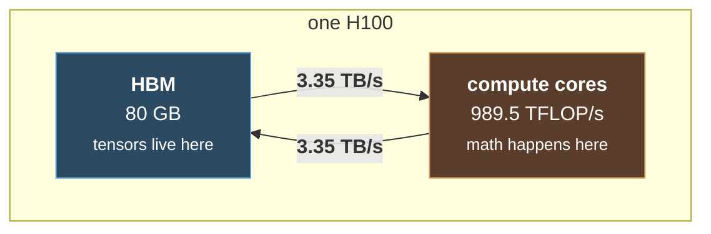
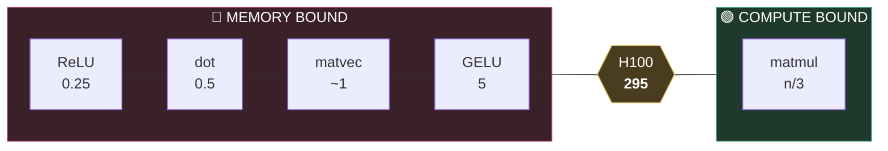
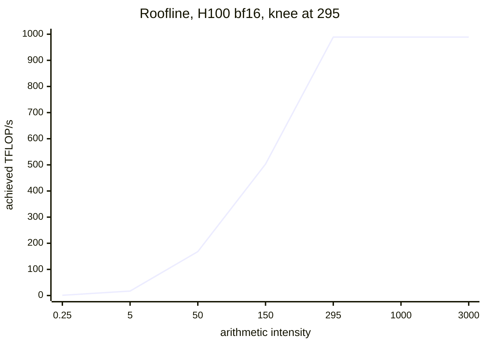
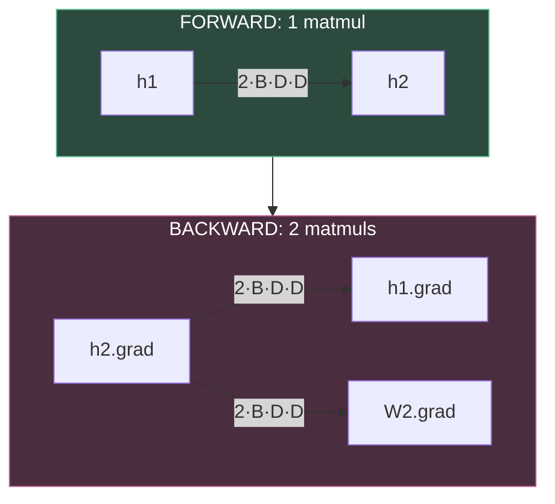

# Resource Accounting

#cs336 #pytorch #systems #flops #memory #einops

CS336 Lecture 2 · [[1. Tokenization]] · [[3. Architectures]]

**Core habit:** every line of tensor code has a cost. Know which resource it spends.

***

## Reference calculations

**Time to train.** 70B params, 15T tokens, 1024 H100s:

```
flops   = 6 × params × tokens = 6 × 70e9 × 15e12 = 6.3e24
rate    = 1024 × 989.5e12 × 0.5 (MFU)            = 5.1e17 flop/s
time    = 6.3e24 / 5.1e17 = 1.24e7 s             = 143 days
```

**Largest trainable model.** 8 H100s, AdamW:

```
memory          = 8 × 80 GB = 640 GB
bytes per param = 2 (bf16 param) + 2 (bf16 grad) + 4 + 4 (fp32 Adam moments) = 12
params          = 640e9 / 12 = 53B
```

Ignores activations, which scale with batch size and sequence length.

***

## Precision

**Exponent bits buy dynamic range. Mantissa bits buy resolution.**

| format | bits | sign / exp / mantissa | notes |
|---|---|---|---|
| fp64 | 64 | 1 / 11 / 52 | scientific computing |
| fp32 | 32 | 1 / 8 / 23 | PyTorch default |
| fp16 | 16 | 1 / 5 / 10 | ❌ range collapses, NaNs |
| **bf16** | 16 | 1 / 8 / 7 | ✅ fp32 range, coarser steps |
| fp8 | 8 | E4M3 or E5M2 | two variants, range vs resolution |
| nvfp4 | 4 | block scaled | Nemotron 3 Super trained on it |

```mermaid
flowchart LR
    subgraph f32 ["fp32 · 32 bits"]
        direction LR
        A1["S"] --- A2["exponent · 8"] --- A3["mantissa · 23"]
    end
    subgraph f16 ["fp16 · 16 bits · range collapses"]
        direction LR
        B1["S"] --- B2["exp · 5"] --- B3["mantissa · 10"]
    end
    subgraph bf ["bf16 · 16 bits · fp32 range"]
        direction LR
        C1["S"] --- C2["exponent · 8"] --- C3["mant · 7"]
    end
    f32 ~~~ f16 ~~~ bf

    style A2 fill:#2d4a63,stroke:#5b9bd5,color:#fff
    style C2 fill:#2d4a63,stroke:#5b9bd5,color:#fff
    style B2 fill:#63344a,stroke:#d55b8f,color:#fff
    style A3 fill:#5a3d2b,stroke:#d59b5b,color:#fff
    style B3 fill:#5a3d2b,stroke:#d59b5b,color:#fff
    style C3 fill:#5a3d2b,stroke:#d59b5b,color:#fff
```



Here are the three that matter, drawn to scale. Watch only the **green exponent field**:

![[cs336_l2_fp32.png]]
![[cs336_l2_fp16.png]]
![[cs336_l2_bf16.png]]

fp16 halves the width by cutting **both** fields, and the green block shrinks from 8 bits to 5. bf16 halves the width by cutting the red mantissa almost to nothing while keeping green at exactly 8, same as fp32. That one visual is the whole argument. Two formats, identical size, and only one of them can still represent the numbers that show up in a real gradient.

**fp16 fails on range, not precision.** Ten to the negative eight is zero in fp16. Training gives underflow, overflow, NaNs. bf16 moves bits from mantissa to exponent: same width, fp32 range, worse resolution. Deep learning is noisy enough that resolution is the cheap thing to give up.

At 8 bits you stop getting to have both, so the format splits in two:

![[cs336_l2_fp8_formats.png]]

E4M3 keeps a bit more mantissa, E5M2 keeps a bit more exponent. Same eight bits, opposite bets, and the H100 supports both. The cost shows up directly in what they can represent: **E4M3 covers** `[-448, 448]` while **E5M2 covers** `[-57344, 57344]`, a range roughly 128 times wider bought with one fewer mantissa bit.

**nvfp4 block scaling:** each value gets 4 bits, the whole block gets a shared scale. So individual values span more range than 4 bits implies, but one huge and one tiny value cannot coexist in a block. Four bits means literally fifteen representable values, and it is worth seeing the whole list:

```
-6, -4, -3, -2, -1.5, -1.0, -0.5, 0.0, 0.5, 1.0, 1.5, 2, 3, 4, 6
```

That is the entire number system. The block scale is what makes it workable.

**Quantizing a trained model to 1 or 2 bits is a different problem from training at that width.** Nobody has trained a credible 1 bit model.

### Mixed precision (standard practice)

| what | precision |
|---|---|
| parameters, activations, gradients | bf16 |
| optimizer states | fp32 (stability) |

PyTorch AMP autocasts: matmuls to bf16, things like `exp` stay fp32.

**Default:** small model, use fp32 and stop thinking. Otherwise bf16 mixed precision. Never plain fp16.

### Why lower precision is faster

1. Less to store.
2. Fewer bits to compute on (~2x per halving, not always).
3. **Less to move.** This is the dominant one.

```
memory = numel × bytes per element
```

***

## einops

Name dimensions instead of counting axes.

**One rule: enumerate every named variable, multiply indexed entries, sum out anything absent from the right side.**

```python
einsum(x, y, "seq1 hidden, hidden seq2 -> seq1 seq2")          # hidden summed out
einsum(x, y, "... seq1 hidden, ... seq2 hidden -> ... seq1 seq2")  # no transpose needed
reduce(x, "... hidden -> ...", "sum")                          # missing dim reduced
rearrange(x, "... (heads h1) -> ... heads h1", heads=2)        # split a dimension
rearrange(x, "... heads h2 -> ... (heads h2)")                 # merge it back
```

* `...` handles any number of batch dims, which matters when juggling batch, sequence, and head.
* Splitting requires one size given, since 8 could be 2 by 4 or 4 by 2. Order inside the parens is the order you get, so it is not ambiguous.
* **Not faster.** Compiles to the same primitives. The win is that transposes stop being something you reason about.

***

## Flops

**Terminology:** *flops* is a quantity of work. *flop/s* is hardware speed. Write the slash.

### Hardware numbers

| | fp32 | bf16 dense |
|---|---|---|
| H100 | 67.5 TFLOP/s | **989.5 TFLOP/s** |
| A100 | 19.5 TFLOP/s | 312 TFLOP/s |

⚠️ **Spec sheet trap.** NVIDIA advertises H100 bf16 at 1979 TFLOP/s *with sparsity*. **Halve it for dense.**

H100 memory bandwidth: **3.35 TB/s**. Anchor: 8 H100s for one week ≈ **5e21 flops**.

### The formula

For `x (B, D) @ w (D, K)`:

```
flops = 2 · B · D · K

B   = tokens
D·K = parameters
⇒ forward flops = 2 × tokens × parameters
```

Elementwise ops cost ~1 flop per element. **Nothing rivals matmul for flops at scale**, so counting matmuls is enough. This stops being true when counting *memory*.

### Timing

```python
torch.cuda.synchronize()   # GPU is async; without this you time the launch, not the work
t0 = time.time()
op()
torch.cuda.synchronize()
```

Repeat and average.

### MFU

```
MFU = actual flop/s / promised flop/s      (promised = halved dense number)
```

| MFU | meaning |
|---|---|
| ~0.8 | bare matmul, nothing else |
| **≥ 0.5** | real model, good |
| ~0.1 | something is broken |
| > 1.0 | impossible |

***

## ⭐ Arithmetic intensity

The central idea. Explains MFU, explains architecture choices, explains why decode is hard.



Runtime depends on **two** hardware numbers, not one. Memory size therefore affects *speed*, not just whether the model fits.

Physically it looks like this, and the proportions are the lesson:

![[cs336_l2_compute_memory.png]]

A wide slab of memory, a bank of compute units that can chew through enormous amounts of math in parallel, and joining them, **one thin straw**. Every flop you want performed requires its operands to be dragged up that straw first. Once you have seen the picture, memory bound versus compute bound stops being jargon. It is just asking whether the straw or the cores ran out of capacity first.

Zooming out one level, that whole GPU still hangs off a bus:

![[cs336_l2_cpu_gpu.png]]

Which is why `x.to("cuda")` is never free, and why you build tensors on the device instead of building them on the CPU and shipping them over.

### Model

Assume communication and compute overlap perfectly:

```
time = max(comm, compute)
comm    = bytes moved / (bytes/s)
compute = flops / (flop/s)

comm > compute  →  MEMORY BOUND
compute > comm  →  COMPUTE BOUND
```

### The two intensities

```
accelerator intensity = flop/s / bytes/s     property of HARDWARE
arithmetic intensity  = flops / bytes moved  property of ALGORITHM
```

**H100 accelerator intensity = 989.5e12 / 3.35e12 ≈ 295.** Remember ~300: an H100 does ~300 flops in the time it moves one byte.

```
intensity < 295  →  memory bound
intensity > 295  →  compute bound
```

### Per operation (bf16, 2 bytes per element)

| op | bytes moved | flops | intensity | verdict |
|---|---|---|---|---|
| ReLU | 4n | n | **0.25** | 🔴 memory |
| dot product | 4n + 2 | 2n | **~0.5** | 🔴 memory |
| matrix vector (n by n) | 2n² + 4n | 2n² | **~1** | 🔴 memory |
| GELU | 4n | ~20n | **~5** | 🔴 memory |
| **matmul (n by n)** | 6n² | 2n³ | **n/3** (~340 at n=1024) | 🟢 compute |



### Consequences

* **GELU costs the same wall clock as ReLU.** 20x the arithmetic, both memory bound, so the extra math is free.
* **Only matmul escapes.** Moves n² bytes to do n³ work, so intensity grows as O(n). **This is why big batches and big matrices matter.** Below the line, shrinking matrices changes nothing.
* **Transformers are compute bound by design.** Big matmuls with small things between.
* **Decode is a matrix vector product**, intensity ~1, memory bound. Training pushes the whole sequence at once, so it is a matmul. This gap is why inference is hard.
* **This is why MFU is ~0.5.** Peak flop/s assumes pure arithmetic. Memory bound stretches are idle cores.

### Roofline



Each point is `min(peak, intensity × bandwidth)`.

**A faster GPU raises the roof. Faster memory rotates the slope. On the slope, a better GPU buys nothing.**

The version with two bandwidths on the same axes makes that last sentence concrete:

![[cs336_l2_roofline.webp]]

Two algorithms, two hardware bandwidths, three regions. **Algo 1** sits down in the pink region and is bandwidth bound on both machines, so upgrading from BW1 to BW2 lifts it straight up and you get real speedup for free. **Algo 2** is off in the green region, already pinned to the roof on both, so that same memory upgrade buys it exactly nothing. The yellow strip in between is the interesting one, where an algorithm is bandwidth bound on the slow machine and compute bound on the fast one.

The practical read: **find out which region you are in before you spend anything.** Buying bandwidth for a compute bound kernel and buying flops for a memory bound one are both ways to spend money and measure no change.

***

## Training compute: where 6ND comes from

The shape everything below is counted against:

![[cs336_l2_deep_network.png]]

Green blocks are activations, `B` by `D`, one per layer boundary. Purple blocks are weights, `D` by `D`. Green scales with your batch size, purple does not, and keeping those two straight is most of the battle in both the flop count here and the memory count further down.

Forward, one layer: `2 · B · D · D`.

Backward computes **two** gradients:

```python
h1_grad = einsum(h2_grad, w2, "batch out, in out -> batch in")   # backward message
w2_grad = einsum(h2_grad, h1, "batch out, batch in -> in out")   # parameter gradient
```

Both walk the same three dims (`batch`, `in`, `out`), differing only in which is summed. **Each costs one forward matmul.**



```
forward  = 2 × tokens × params
backward = 4 × tokens × params
total    = 6 × tokens × params
```

⚠️ **Breaks with long context**, which adds an O(seq_len²) attention term this misses.

***

## Training memory

For a `D²L` network, bf16 weights with fp32 optimizer states:

| consumer | size | note |
|---|---|---|
| parameters | 2 · D² · L | 2 bytes each |
| activations | 2 · B · D · L | **scales with batch size** |
| gradients | 2 × params | same shape as params |
| optimizer state | 4 bytes per moment per param | fp32 for stability |

Optimizer state per parameter: SGD 0, **AdaGrad 4**, **Adam/AdamW 8**.

**Asymmetry worth knowing:** memory does two jobs, fitting in HBM and being shipped to cores. Optimizer state is not on the compute critical path, so its size **caps model size but barely affects speed.**

Why fp32 there: you square gradients and average over thousands of steps, and bf16 is not stable enough.

***

## Cutting memory

### Gradient accumulation

Activation memory scales with batch size, so large batches OOM. Split into **microbatches**, compute gradients on each, **do not zero them**. After `batch / microbatch` steps, step the optimizer and clear.

Same effective batch size, far less activation memory.

### Activation checkpointing

Training stores all activations for the backward pass. Instead keep a subset and **recompute** the rest from the nearest kept one. Classic trade: compute for memory.

Go back to the same picture and count only the green blocks:

![[cs336_l2_deep_network.png]]

Training has to hold **every** green block alive until the backward pass reaches it, which is where the `L` in the table below comes from. Inference holds exactly one, because nothing needs to be reconstructed afterward. Checkpointing is just choosing a number in between.

```python
torch.utils.checkpoint.checkpoint(block, x)
```

| strategy | memory | recompute |
|---|---|---|
| store everything (default) | L | none |
| **checkpoint every √L** | **√L** | **√L** ← balanced |
| store nothing | ~1 | L² |


Filled means kept, hollow means recomputed. Inference needs only the current layer's activations, which is why its memory profile differs.

***

## Open

* [ ] Compute MFU for my own A1 loop
* [ ] Transformer flop count including the seq_len² attention term
