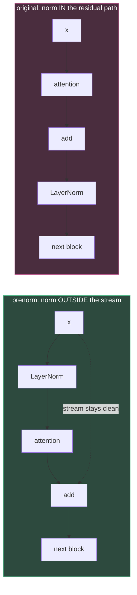
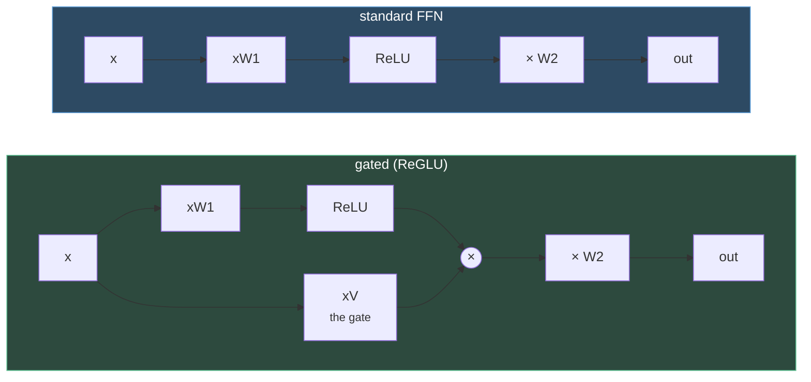
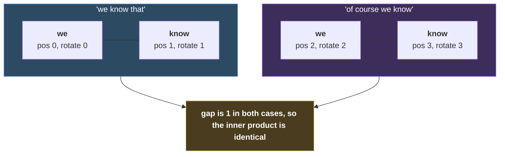
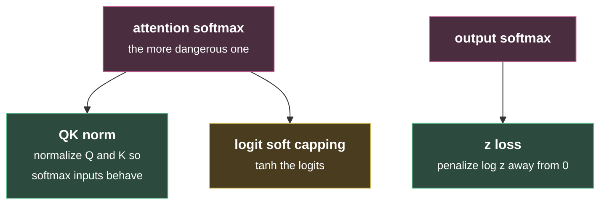
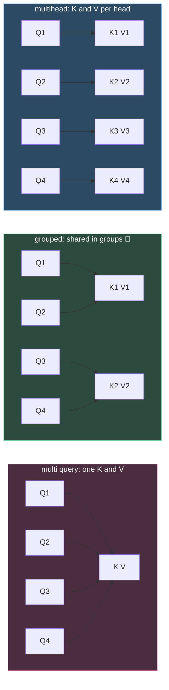

# Architectures and Hyperparameters

#cs336 #architecture #transformer #rope #attention #stability

CS336 Lecture 3 · [[1. Tokenization]] · [[2. Resource Accounting]]

**Method:** you cannot sweep the design space yourself, so read it off the models people shipped. What is fixed everywhere is consensus. What varies freely does not matter much.

**An architecture balances three things:** generalize from data, run efficiently on GPUs, and not blow up mid run. That is why it ends up inelegant.

***

## The consensus, at a glance

| choice | answer | why |
|---|---|---|
| norm placement | **prenorm, outside the residual stream** | clean residual path, gradients flow straight back |
| norm type | **RMSNorm** | same quality, fewer ops and params to move |
| bias terms | **drop them** | memory bound, no expressiveness gain |
| FFN | **gated (SwiGLU or GeGLU)** | consistent gains, parameter matched |
| block layout | **serial** | parallel loses depth, systems win no longer worth it |
| position | **RoPE** | truly relative, no cross terms |
| attention | **GQA** | KV cache is the inference bottleneck |
| long context | **interleave sliding window with full attention** | quadratic cost only every Nth layer |
| stability | **z loss, QK norm** | softmaxes are the failure point |

Deviating from any of these needs a reason. The 2017 transformer otherwise held up: the only real changes are norm placement, bias removal, and gating.

### The evidence behind all of it

Tatsu's survey table, which is the primary source for this whole lecture. Every autoregressive LM from 2017 to 2026, with norm type, parallel vs serial, prenorm flag, position embedding, activation, MoE, other tricks, MLP factor, layers, model dim, aspect ratio, heads, dropout.

![[cs336_l3_model_table.png]]

Read the columns vertically and the consensus is obvious: the Norm column goes LayerNorm then all RMSNorm, Position goes Sine to Absolute to Relative to RoPE to Hybrid, Activations go ReLU to GeLU to SwiGLU. **The convergence is visible as a shape, not just a claim.**

Also visible and worth noting: AliBi shows up as a position embedding in BLOOM and Baichuan 2, which the lecture skipped over.

***

## Normalization

### Placement

Original put the norm **in the residual path**. Modern models put it **outside**, usually before the computation (prenorm).



**Reason: keep the residual stream clean.** `x` reaches the output untouched, so gradients propagate straight back. Prenorm holds gradient magnitude roughly constant at init (Xiong 2020). Post norm renormalizes at every block, shifting gradient norms on the way back, and shows larger and more frequent spikes (Salazar and Nguyen 2019).

![[cs336_l3_gradient_attenuation.png]]

**This is the whole argument in one picture.** Blue (prenorm) stays flat across layers 1 to 6. Orange (post norm at init) grows with depth, so deeper means worse. Green shows post norm only becomes tolerable *after* warmup, which is exactly why post norm needed warmup in the first place.

![[cs336_l3_prenorm_convergence.png]]

And the downstream effect: without warmup, post norm converges to worse validation loss and worse BLEU. Prenorm without warmup matches post norm *with* warmup.

The original selling point was removing warmup. What it is actually kept for is **stability and larger learning rates on big networks.**

Universal except **OPT 350M**. BERT was post norm.

**Variants that also work:** norm *after* the computation but still outside the stream (Grok, Gemma 2, OLMo 2), or norms in both places (double norm).

> **Recurring lesson: stability problems respond to adding more LayerNorms.** Sounds absurd, keeps being true. It is the logic behind QK norm below.

### RMSNorm over LayerNorm

RMSNorm drops the mean subtraction and the bias. LayerNorm is strictly more expressive, and it does not matter.

**The systems argument, and the number that makes it:**

> LayerNorm is **~0.17% of flops** and **up to 25% of runtime** (Ivanov et al 2023).

**Flops are not runtime.** Normalizations move a lot of activation data relative to their arithmetic, so they sit at low arithmetic intensity ([[2. Resource Accounting]]). Delete ops that move memory without buying expressiveness. Narang et al 2020 found more steps per second *and* slightly better loss.

Same logic kills **bias terms** on linear layers. Also removes a source of stability trouble.

Users: LayerNorm in GPT 1/2/3, OPT, GPTJ, BLOOM. RMSNorm in the Llama family, PaLM, Chinchilla, T5.

***

## Activations and gating

Plain **ReLU** works (original transformer, T5, Gopher, Chinchilla, OPT). **GeLU** adds a divot near zero, changing gradients near the origin (GPT 1/2/3, GPTJ, GPT NeoX, BLOOM).

**Gated linear units are the consensus.** Take a normal FFN and add a second matrix `V` whose output multiplies the activation entrywise, then down project.



Naming is mechanical: activation plus GLU. ReLU gives ReGLU, GeLU gives GeGLU, Swish (`x · sigmoid`) gives SwiGLU.

> ⚠️ **Gated layers have three matrices, not two. Shrink the feedforward dim by 2/3 to keep parameters matched.** This is why configs show 2.67.

Evidence: Shazeer 2020 reports small but consistent gains with error bars over replicates, parameter matched. Narang et al 2020 corroborates.

Users: **GeGLU** in T5 v1.1, mT5, LaMDA, Phi3, Gemma 2/3/4. **SwiGLU** in Llama 1/2/3, PaLM, Mistral, OLMo, most models after 2023.

Not mandatory: GPT 3 had no GLU, Nemotron 340B used squared ReLU. But it is rare now.

## Serial over parallel blocks

![[cs336_l3_serial_block.png]]

Parallel blocks add attention and MLP outputs into the residual stream simultaneously, letting you share norms and fuse matmuls. Used by GPTJ, PaLM, GPT NeoX, and later Cohere Command A and R plus, Falcon 2 11B.

**Abandoned.** Serial optimization improved enough that the systems win stopped covering the cost, which is effectively **halving your depth**. PaLM claimed no quality drop and 15% better utilization, but later Google models dropped it. No clean public ablations exist.

***

## Position embeddings

Attention is inner products, so it is position blind. Position must be injected.

| scheme | mechanism | users |
|---|---|---|
| sine | add sines and cosines to embeddings | original transformer |
| absolute | learned vector per position | GPT 1/2/3, OPT |
| relative | add a term to the attention matrix | T5, Gopher, Chinchilla |
| **RoPE** | rotate embeddings by position | GPTJ, PaLM, Llama, most 2024+ |

### RoPE

**Requirement:** the inner product of two position aware embeddings should depend only on the **gap** between positions.

Why the others fail:
* **Sine:** produces cross terms between position and word embeddings, from which absolute position is recoverable.
* **Absolute:** not relative by construction.
* **Relative:** genuinely relative but not an embedding, since it is added to the attention matrix and has no inner product structure.

**Solution: inner products are invariant to rotation.** Rotate each position independent word vector by an angle set by its position.



**In D dimensions:** chop the vector into coordinate pairs and rotate each pair in 2D. Frequencies vary, so slow pairs capture long range and fast pairs capture adjacency. Su et al 2021 motivates this via complex numbers, but the rotation picture is sufficient.

**Implementation:** build cos and sin from position IDs, apply to **queries and keys**, at **every attention operation** rather than once at the bottom. You are **multiplying**, not adding, which is exactly what removes the cross terms.

![[cs336_l3_rope_code.png]]

Note where it sits: after the QKV projections and the reshape into heads, `rotary_emb` builds cos and sin from `position_ids`, then `apply_rotary_pos_emb` touches **only query and key**, never value. Useful shape reference for A1.

**Gemma 4 variant (pRoPE):** rotate only the first two coordinates. Low frequency components barely rotate anyway. An optimization for small hidden dims.

***

## Hyperparameters

Most sit in wide flat basins. Pick something standard and spend your attention on systems.

### Feedforward ratio

**`d_ff = 4 · d_model`**, or **8/3 ≈ 2.67** for GLUs after the parameter matching adjustment.

Observed: Qwen 14B 2.67, Llama 70B and DeepSeek 67B 2.68, Yi 34B 2.85, T5 v1.1 2.5, Mistral 7B and Llama 2 70B 3.5, PaLM 4.

**Kaplan 2020: a flat basin from ~1 to 10.** Loss climbs quadratically above ~10.

**T5 outlier:** 65536 / 1024 = **64x**, on a systems argument that bigger matmuls utilize hardware better. Gemma 2 uses 8x. But T5 v1.1, the improved version, **reverted to 2.5**, which suggests 64x was suboptimal.

### Head dimension

**`num_heads × head_dim = d_model`**, so ratio 1. Followed by GPT 3, Llama 2, Qwen 3.5. Exceptions are Google models, T5 at 16 being the extreme.

⚠️ Standard but with **low to no validation.** Nobody has shown it is right.

### Aspect ratio (`d_model / n_layers`)

**Roughly 100 to 200.** This is what you fix when scaling a model up or down, so it governs depth versus width permanently.

Observed: Gemma 4 61, Gemma 3 87, Llama 102, GPT 3 / OPT / Mistral / Qwen 128, PaLM 540B 156, T5 v1.1 171, BLOOM 205, T5 11B 33.

**The tradeoff is systems, not expressiveness:**
* Deep models must be split along layers, which is **pipeline parallel**, which nobody wants. Also worse latency (Tay et al 2021).
* Wide models split cleanly with **tensor parallel**, which is far simpler.

Kaplan 2020 finds the optimum roughly size independent. Tay et al 2021 finds that across depth and width sweeps, **flops predict quality, not the aspect ratio.**

### Vocabulary size

| kind | size |
|---|---|
| monolingual | 30k to 50k |
| multilingual / production | 100k to 250k |

Examples: original transformer 37k, GPT 2/3 50257, Llama 32000, GPT 4 100276, DeepSeek 100000, Qwen 152064, mT5 250000, PaLM 256000, Gemma 4 262144.

Two effects are tangled: multilingual genuinely needs more coverage, and larger models can support larger vocabularies. Nobody trains large monolingual models now.

**Comparing bits per byte across tokenizers is valid** provided the tokenizer is complete (modern subword ones are; older ones dropped tokens) and normalization is by byte count, which is constant. Perplexity and bits per byte are dual.

### Regularization

Standard argument says skip it: more data than flops, single pass, no memorization, therefore no overfitting.

**But models do regularize.** Older models used dropout at 0.1 (original transformer, GPT 2, T5, GPT 3, OPT). Newer models dropped it and kept weight decay at 0.1 (T5 v1.1, PaLM, Llama). Qwen is the recent holdout doing both. Most papers do not discuss dropout, which for open models tracks not doing it.

> **Weight decay is not regularizing here. It improves optimization** by interacting with the cosine learning rate schedule (Andriushchenko et al 2023).

Evidence: train against validation loss shows no separation across weight decay settings, so there is no overfitting to control. But combined with **learning rate decay**, stronger weight decay starts slower and converges to a better minimum. Does not hold at constant learning rate.

***

## Stability

Matters more as runs get expensive. A spike can leave a bad model, or an **unrecoverable** one after millions of dollars.

![[cs336_l3_loss_spikes.png]]

What the fix buys you, on real runs: blue is the original OLMo 7B, orange is OLMo 2 after the stability work. Top panel is loss, bottom is gradient L2 norm. The blue gradient norm spikes constantly for the entire run while orange stays flat. **The loss curves alone barely show it, which is the point.** Watch gradient norms, not just loss.

**Softmaxes are the failure point**: they contain an exponential and a division. There are exactly two.



### z loss (output softmax)

Log probability is model output `u` minus log normalizer `log z`. `u` behaves. `z` is an exponential, so it can explode or hit zero. You want `z` near 1.

**The opening: the softmax is overparameterized.** Adding a constant to `u` cancels, so `z` can be moved without changing predictions. So penalize `(log z)²`.

Devlin 2014. Used by PaLM, then Baichuan 2 (2023), DCLM (2024), OLMo 2 and 3.

### QK norm (attention softmax)

Normalize Q and K before their matmul, so softmax inputs sit at scale ~1.

From vision and multimodal work (Dehghani 2023, Idefics, Chameleon). Now standard: DCLM, OLMo 2 and 3, Gemma 2 and 4, Qwen3.

**Free.** No measurable quality cost, prevents attention degeneracies, and allows higher learning rates.

Note the trajectory: norms moved to prenorm, then after nonlinearities, now onto Q and K.

### Logit soft capping

Pass logits through a tanh so they are bounded. Mostly Google (Gemma 2/3/4).

⚠️ **Costs quality.** NVIDIA's systematic comparison found soft capping alone loses performance, since the model can never express high confidence. QK norm is the better default.

***

## Attention variants

### Why GQA exists

At deployment you pay for **flops and memory accesses**.

**Training or prefill.** Arithmetic ~`b·n·d²`. Intensity is governed by head dim `k` and by `b·n`, so with reasonable head dims and long enough sequences or big enough batches, GPUs stay busy. Fine.

**Generation.** Cannot parallelize; one token at a time. A **KV cache** stores past keys and values so you only compute new interactions. That saves compute but **re reads parameters every step**, adding an `n·d²` memory term where it was `d²`.

```
incremental intensity ~ (n/d + 1/b)⁻¹
```

So you need **large batches and short sequences, or a big model dimension.** The `n/d` term is hard to shrink. Bad for serving small models.

### The fix



**MQA:** one K and V shared across all heads, queries stay per head. The bad term becomes **`n/(dh)`**, divided by head count, so intensity improves a lot. Costs real expressiveness.

![[cs336_l3_mqa.png]]

The dataflow: QKV projection emits **one** K and **one** V but Q per head, so there is a single K cache and a single V cache regardless of head count, broadcast to every head's dot product attention. That collapse is exactly what shrinks the memory traffic.

**GQA:** reduce KV heads but keep all query heads. The ratio is a tunable knob.

Quality: MQA takes a small perplexity hit (Shazeer 2019); GQA takes **low to none** (Ainslie 2023). Even a small reduction in KV heads captures most of the gain, so GQA is near universal.

⚠️ **Not an inference only change.** You train with the grouped structure.

Related: DeepSeek V2 multihead latent attention, a different factorization.

### Sliding window and interleaving

Full attention is quadratic. Restrict it to a local band instead (Child et al 2019; used by GPT 3, Mistral, GPT OSS).

**Current standard: interleave.** Cohere Command A does one full attention layer every four, with sliding window layers between. Local layers **aggregate local information into progressively more global representations**, so later local layers still reach global context indirectly.

Also seen: dropping RoPE on long range layers (NoPE) so long range is nearly a bag of words while short range keeps position.

Users: Llama 4, Gemma 3, Gemma 4, OLMo 3 (sliding window plus full RoPE). Qwen 3.5 and Qwen 3 Next use the same alternating structure but substitute a state space model (Gated DeltaNet) for the cheap layer.

**This is the most active area of architecture research right now.** Exotic state space work (Jamba, Falcon 3, Qwen 3.5) is next lecture.

***

## Open

* [ ] Verify the RoPE relative angle property in my A1 implementation
* [ ] Confirm my GLU config applies the 2/3 adjustment
* [ ] Try QK norm and see if it permits a higher learning rate
