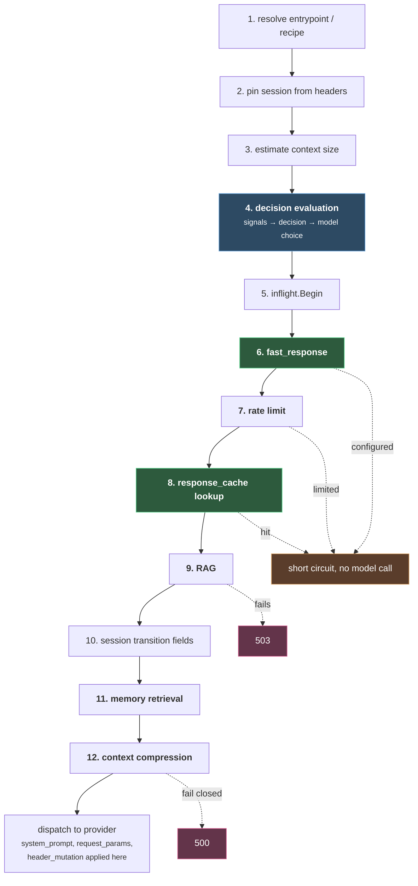

# Plugin Chain

#vllm #routing #inference #llmops

Layer 3 of [[1. Overview]] · [[2. Signal Extraction]] · [[3. Decision Engine]]

Read from source at commit `63e91c2`. Package `pkg/extproc`, catalog in `pkg/config/routing_surface_catalog.go`.

***

## What this layer is

Once a decision wins, it carries a list of plugins and one selection algorithm. The plugins run around the model call, some before and some after, and several of them can end the request without ever touching a model.

There is **no plugin registry and no dynamic dispatch.** The order is hardcoded as a sequence of function calls in `runRequestPreRoutingStages` and `handleNonStreamingResponseBody`. Each plugin's config is read off the winning decision when its turn comes. That means the order is fixed by the binary, not by the order you list plugins in YAML.

## The thirteen plugin types

From `supportedDecisionPluginTypes`, which is what config validation enforces:

| plugin | side | what it does |
|---|---|---|
| `fast_response` | pre | return a canned message, skip the model entirely |
| `response_cache` | both | lookup before, write after |
| `rag` | pre | retrieve and inject context |
| `memory` | pre and post | retrieve prior turns, store new ones |
| `context_compression` | pre | shrink the prompt |
| `system_prompt` | pre | insert or replace the system message |
| `request_params` | pre | override sampling parameters |
| `tools` / `tool_selection` | pre | pick which tools to expose |
| `header_mutation` | pre | rewrite outgoing headers, including provider auth |
| `hallucination` | post | HaluGate |
| `response_jailbreak` | post | check the model's own output |
| `router_replay` | both | record the whole decision for replay |

`semantic-cache`, `semantic_cache` and `response-cache` are all aliases normalized to `response_cache`. Validation rejects the same plugin type twice on one decision.

## The actual request order



**Model selection happens at step 4, inside decision evaluation**, not in the plugin chain. The paper puts "select m" in the plugin layer. In the code the model is already chosen before the first plugin runs, which is why `fast_response` and cache hits can call `inflight.End` on a model that was picked but never invoked.

### Failure policy is deliberately inconsistent

The interesting part. Three plugins in a row, three different attitudes to failure:

| plugin | on failure | code |
|---|---|---|
| RAG | **fail closed, loudly**. 503 | `createErrorResponse(503, ...)` |
| memory retrieval | **fail open, silently**. Log and continue | `"fallback": "continue_without_memory"` |
| context compression | **fail closed** if policy says so. 500 | `"Context compression failed under fail_closed policy"` |

That is the right set of choices, not an oversight. If retrieval was supposed to ground the answer and retrieval broke, answering anyway means answering ungrounded, so RAG aborts. Memory is an enrichment, so losing it degrades personalization but not correctness, and it continues. Compression is configurable because whether a too long prompt should fail or be sent as is depends on your backend.

Error codes worth recognizing:

| code | meaning |
|---|---|
| 499 | client canceled |
| 422 | no decision candidate can satisfy the request's context length |
| 403 | decision evaluation failed generally |
| 503 | decision unresolved via `on_unknown: fail_request`, or RAG failure |
| 500 | context compression failed closed |
| 502 | model returned an invalid or incompatible response |

## The response order

```go
r.updateResponseCache(ctx, clientBody)

if jailbreakResponse := r.performSemanticResponseJailbreakDetection(...); jailbreakResponse != nil {
    return jailbreakResponse
}
if hallucinationResponse := r.performSemanticHallucinationDetection(...); hallucinationResponse != nil {
    return hallucinationResponse
}

r.scheduleSemanticResponseMemoryStore(ctx, semanticResponse)
r.markUnverifiedFactualResponse(ctx)
response, finalBody := r.applySemanticResponseWarnings(ctx, semanticResponse, clientBody)
```

⚠️ **The cache write happens before both safety checks.** `updateResponseCache` skips writes for exactly four reasons: caching disabled, the request said no store, upstream status was not 2xx, or the decision emitted `retention.drop`. A response that then fails response jailbreak detection has already been written.

The contrast with memory makes this stand out, because memory clearly *was* thought about:

```go
if r.MemoryExtractor == nil || !autoStoreEnabled || ctx.ResponseJailbreakDetected {
    return
}
```

Memory refuses to store a response flagged as jailbroken. The cache has no equivalent guard, and it could not use one anyway given it runs first. I have not run this, so treat it as an ordering observation rather than a confirmed exploit, but the asymmetry is in the source and it is the sort of thing worth checking before enabling response caching alongside response jailbreak detection.

Post response warnings are additive: hallucination, unverified factual, and jailbreak each contribute a code, and they are collected into one warnings header. The body is only re encoded if something actually changed it.

## Selection algorithms, and how many are real

**The paper says thirteen algorithms. The catalog has sixteen, and marks eight of them experimental.**

| tier | algorithms |
|---|---|
| **supported** | `static`, `ratings`, `confidence`, `hybrid`, `latency_aware`, `multi_factor`, `router_dc`, `remom` |
| **experimental** | `automix`, `fusion`, `kmeans`, `knn`, `mlp`, `svm`, `workflows`, `prompt` |

This reframes the paper's menu considerably. Every classical ML method it presents, `knn`, `kmeans`, `svm` and `mlp`, is experimental. So is `automix`, which the paper offers as the recommended choice for cost optimized deployments. The production ready set is much smaller and much more boring: static, ratings, latency aware, hybrid, multi factor, RouterDC, ReMoM.

Also worth noting, the paper names Thompson Sampling and GMTRouter as algorithms. **Neither appears in the catalog.** `ratings` is presumably where Elo lives. Meanwhile `multi_factor`, `fusion`, `workflows` and `prompt` are in the code and not in the paper.

Each entry also declares an execution path:

| execution | meaning | algorithms |
|---|---|---|
| `selector` | picks one model, one call | static, hybrid, latency_aware, multi_factor, router_dc, automix, knn, kmeans, svm, mlp, prompt |
| `looper` | may make several model calls | confidence, ratings, remom, fusion, workflows |

That distinction is a cost signal. **A looper algorithm can call models more than once per request**, which is obvious for ReMoM but easy to miss for `confidence` and `ratings`.

## Worked example

Finishing the request from [[1. Overview]], [[2. Signal Extraction]] and [[3. Decision Engine]]. `urgent_automix_route` won, and this is its full plugin and algorithm config, verbatim:

```yaml
modelRefs:
  - model: qwen3-8b
    use_reasoning: false
  - model: qwen3-32b
    use_reasoning: true
algorithm:
  type: automix
  automix:
    verification_threshold: 0.78
    max_escalations: 2
    cost_aware_routing: true
    cost_quality_tradeoff: 0.35
    use_logprob_verification: true
plugins:
  - type: response_jailbreak
    configuration:
      enabled: true
      threshold: 0.85
      action: header
```

Walking the chain in the order the code runs it:

| step | what happens here |
|---|---|
| 4. decision evaluation | winner picked, **and AutoMix picks `qwen3-8b`** |
| 6. `fast_response` | not configured, skipped |
| 7. rate limit | passes |
| 8. `response_cache` | not configured on this decision, no lookup |
| 9. RAG | not configured, skipped |
| 11. memory | not configured, skipped |
| 12. context compression | not configured, skipped |
| dispatch | request goes to `qwen3-8b` |

Notice how little runs. **A decision only pays for the plugins it declares**, and this one declares exactly one, on the response side.

### The escalation, which is easy to miss

AutoMix sends `qwen3-8b` first. If verification comes back under `0.78`, it escalates to `qwen3-32b`, up to `max_escalations: 2`. So this single client request can become **two or three upstream model calls**, and the client never learns that.

This is the cost trap worth internalizing. The [[3. Decision Engine]] chose a decision in well under a millisecond, [[2. Signal Extraction]] cost roughly one classifier forward pass, and then the algorithm quietly made the expensive choice. Also note `automix` is tiered **experimental** in the catalog, despite the paper recommending it for cost optimized deployments.

### On the way back

```
updateResponseCache          → skipped, no cache on this decision
response_jailbreak @ 0.85    → action: header
hallucination                → not configured
memory store                 → not configured
warnings header              → set if the jailbreak code fired
```

`action: header` is the softest of the available responses. The reply still reaches the client, with a warning code attached to the response headers rather than being blocked. That is a reasonable choice for an urgent operational query, where a false positive that swallows the answer costs more than the risk it guards against.

It also sidesteps the cache ordering issue described above, since nothing was cached on this route. **A decision that had enabled `response_cache` alongside `response_jailbreak` would have written the response before checking it.**

## Plugins are per decision, and that is the point

The same plugin behaves differently on different routes because the config lives on the decision:

```yaml
plugins:
  - type: system_prompt
    configuration:
      enabled: true
      mode: insert
      system_prompt: You are a senior business consultant.
  - type: response_cache
    configuration:
      enabled: true
      mode: exact_then_semantic
      scope: user
      semantic:
        similarity_threshold: 0.82
      ttl_seconds: 7200
      request_controls:
        enabled: true
        header: x-vsr-cache-control
        allowed: [no-cache, no-store, bypass, max-age, ttl]
        max_ttl_seconds: 7200
```

Three cache modes: `exact`, `semantic`, `exact_then_semantic`. `scope: user` keys entries per user, which is what stops one person's answer being served to another after a RAG or memory injection made it personal.

`request_controls` is a nice touch. It lets clients send cache directives in a header, but only from an allowlist and only up to a `max_ttl_seconds` you set. Client influence without client control.

**Defaults**, from `canonical_defaults.go`:

| setting | default |
|---|---|
| response cache | enabled, in memory backend |
| max entries | 1000 |
| TTL | 3600 s |
| eviction | FIFO |
| memory retrieval limit | 5 |
| memory similarity threshold | 0.70 |

The paper's 0.92 cache threshold is an evaluation setting, not a default. The shipped example uses 0.82. An in memory backend with 1000 entries and FIFO eviction is a development default, not a production one.

## Router replay

Undocumented in the paper and the most useful operational feature here. It records the routing decision and the response, with an explicit lifecycle, and it is wired into every terminal path including panics:

```go
r.finalizeRouterReplay(ctx, routerreplay.LifecycleFailed, "processor_panic")
```

Fast responses, unresolved decisions, hallucination status and streaming aborts all get recorded with a reason string. Given that this system's whole job is making an opaque choice on every request, having the choice recorded and replayable is arguably the feature you would miss most.

***

## Open

* [ ] Check the cache write ordering against response jailbreak detection on a live instance
* [ ] Audit which algorithms in use are experimental tier, since half the catalog is
* [ ] Identify any looper algorithm in the config and work out its real cost per request
* [ ] Replace the in memory cache backend before production. 1000 entries with FIFO is a dev default
* [ ] Set `scope: user` on any cache sitting on a decision that also runs RAG or memory
