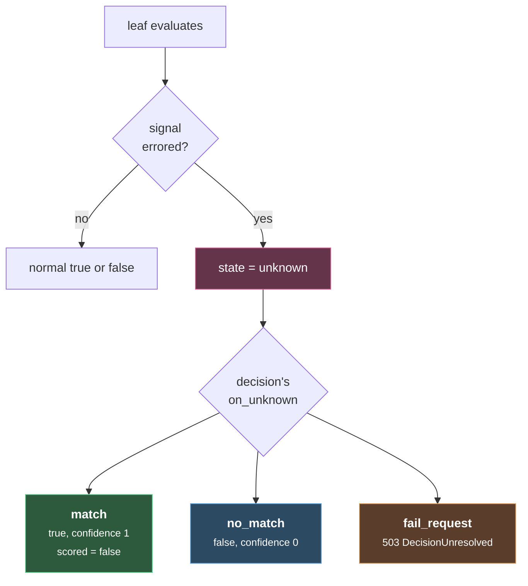

# Decision Engine

#vllm #routing #inference #llmops

Layer 2 of [[Overview]] · [[Signal Extraction]] · [[Plugin Chain]]

Read from source at commit `63e91c2`. Package `pkg/decision`, mostly `engine.go` and `selection.go`.

***

## The headline correction

**The paper describes Boolean logic over `{and, or, not}`. The code implements three valued logic.**

```go
const (
    evaluationFalse evaluationState = iota
    evaluationTrue
    evaluationUnknown
)
```

That third state is the whole difference, and it exists because signals fail. A classifier times out, a remote category call errors, a model is not loaded. In two valued logic a failed signal is indistinguishable from a signal that genuinely did not match, and those two things should absolutely not route the same way. So a failed signal evaluates to `unknown`, unknown propagates up the tree, and each decision declares what it wants done about that.

Everything else in this layer follows from having a third state.

## A decision

```yaml
- name: static_business_route
  description: Static fallback for standard business traffic.
  priority: 200
  tier: 2
  rules:
    operator: AND
    conditions:
      - type: domain
        name: business
  modelRefs:
    - model: qwen3-8b
      use_reasoning: false
  algorithm:
    type: static
  plugins:
    - type: system_prompt
      configuration: { ... }
```

`rules` is a tree. `modelRefs` is this decision's private candidate pool. `algorithm` picks from that pool. `plugins` attach behavior. `priority` and `tier` decide who wins when several decisions match.

## Evaluating the tree

`evalNode` recurses. One detail that will bite you:

```go
switch strings.ToUpper(node.Operator) {
case "AND":  return e.evalAND(...)
case "NOT":  return e.evalNOT(...)
default:     return e.evalOR(...)
}
```

**OR is the default.** Not AND. Misspell your operator, or leave it out, and you get OR, which is the permissive direction. For a rule guarding access to an expensive or sensitive model pool, that is the wrong way to fail.

`NOT` is strictly unary. Give it zero or two children and it logs a warning and returns non match rather than erroring.

### Confidence, per operator

Each operator computes confidence differently, and the paper only documents the first:

| operator | confidence |
|---|---|
| `AND` | **mean** over matched children |
| `OR` | the **best** child, by `preferredMatch` |
| `NOT` | constant **1.0** |
| leaf | whatever the signal reported, else 1.0 |

`preferredMatch` prefers a child that did not hit an error, and only then prefers higher confidence. So an error free 0.6 beats an error tainted 0.9.

### The subtlety that makes ranking honest

This is the best idea in the file. Not every signal reports a confidence. Keyword, language and PII just match or do not. When one of those matches, the engine has to put *something* in the confidence slot, and it uses 1.0:

```go
// signalConfidence returns the reported score for a signal and whether one
// was reported at all. Signals that report nothing rank with the structural
// default 1.0, which selection must not compare against reported scores.
```

A structural 1.0 is **not** the same kind of number as a cosine similarity of 0.88. Ranking them against each other would mean a keyword match beats every embedding match forever, purely because keyword matching has no opinion about degree.

So every evaluation carries a `ConfidenceScored` flag, and it is conjunctive: an AND node stays scored only if all its children were scored. Then, at selection time:

```go
if !result.CatchAll && !result.ConfidenceScored {
    comparable = false
}
```

**One unscored decision in the pool makes the entire pool incomparable**, and selection silently falls back to priority ordering for all of it. Confidence based selection is therefore something you get only when every competing decision is backed by real scores. Nobody advertises this and it changes how your config behaves.

## Numeric predicates

Entirely absent from the paper. A leaf can compare a signal's raw numeric value instead of just checking membership:

```go
if predicate.GT  != nil && value <= *predicate.GT  { return false }
if predicate.GTE != nil && value <  *predicate.GTE { return false }
if predicate.LT  != nil && value >= *predicate.LT  { return false }
if predicate.LTE != nil && value >  *predicate.LTE { return false }
```

The value is looked up from `SignalValues` first, falling back to `SignalConfidences`, keyed by `type:name` or `type:name:label`. NaN and infinity always fail. That last check matters more than it looks, since a classifier returning NaN would otherwise satisfy any comparison you wrote.

Predicate leaves also take `on_error: match`, a per leaf fail open switch, which is the only place in the engine where you can opt into treating a broken signal as a match without going through the `on_unknown` machinery.

## What happens when a signal fails



Three policies, set per decision as `rules.on_unknown`:

| policy | behavior | when you want it |
|---|---|---|
| `match` | treat as matched, confidence 1, marked unscored | fail open. A cache or enrichment route |
| `no_match` | treat as unmatched | fail closed, quietly. Let a lower priority route take it |
| `fail_request` | abort with 503 | fail closed, loudly. A safety route that must not be bypassed |

`fail_request` is the one that matters for guardrails. If your PII classifier is down, a decision that restricts PII bearing traffic to on premise models should not silently stop matching, because the traffic would then fall through to whatever generic route catches it. `fail_request` turns a broken guardrail into a visible outage instead of a silent leak.

Note also that `match` sets `scored: false`, which as established poisons confidence comparison for the whole pool. Failing open has a ranking cost.

**If `on_unknown` is unset**, unknown never arises: `evalLeaf` only returns unknown when `policy != ""`. Without a policy, a failed signal is just a non match carrying an `onError` flag.

## Choosing among matched decisions

Three strategies, not the two the paper describes.

```go
useTieredSelection := e.useTieredSelection(results)
```

**Tiered activates automatically** whenever any matched decision has `Tier > 0`. You do not select it in config, it selects itself. Otherwise you get the configured strategy, defaulting to priority.

Tie break order, top to bottom:

| | tiered | confidence | priority |
|---|---|---|---|
| 1 | lower tier wins | catch all ranks last | **higher priority** |
| 2 | catch all ranks last | **higher confidence**, if comparable | higher confidence, if comparable |
| 3 | higher confidence, if comparable | higher priority | name, ascending |
| 4 | higher priority | name, ascending | |
| 5 | name, ascending | | |

Two things to take from that table. **Lower tier number wins**, so tier is a precedence class rather than a score. And every chain ends at `Decision.Name` ascending, so ordering is fully deterministic. No map iteration randomness, no config order dependence, same request always picks the same decision.

### Catch alls

```go
func isCatchAllRules(rules config.RuleCombination) bool {
    if rules.IsEmpty() { return true }
    return !rules.IsLeaf() && strings.ToUpper(rules.Operator) == "AND" && len(rules.Conditions) == 0
}
```

Omitted rules, or an explicit empty AND. Both mean "always match", and both get pushed behind any signal backed decision under tiered and confidence selection. Under plain priority selection catch all is **not** special cased, so a catch all with a high priority number will beat real matches. Worth knowing before you set one to 999.

## Domain is not a plain string match

Every other signal type does `slices.Contains(rules, name)`. Domain gets `matchesDomainCondition`, which matches directly *or* through the category's `mmlu_categories` list. So a condition on `business` also fires when the classifier detected any MMLU category mapped under business. Convenient, and worth remembering when a domain condition matches something you did not expect.

## Cost

`RecordDecisionEvaluation` wraps every call. The paper measures under 0.1 ms for 10 decisions and under 0.5 ms for 100, and the code makes that plausible: it is tree walking over small string slices with no I/O and no allocation of consequence. **Decision evaluation is free. Your latency is entirely in [[Signal Extraction]].**

The engine also has a full trace mode producing a `TraceNode` tree with per node state, confidence and scored flags. That is what to reach for when a route fires and you cannot see why.

***

## Open

* [ ] Audit every decision for a missing `operator`, since the default is the permissive OR
* [ ] Decide `on_unknown` deliberately per decision. Anything acting as a guardrail probably wants `fail_request`
* [ ] Check whether any high priority catch all is shadowing real routes under plain priority selection
* [ ] Try confidence selection and verify the pool is actually comparable, otherwise it silently behaves as priority
