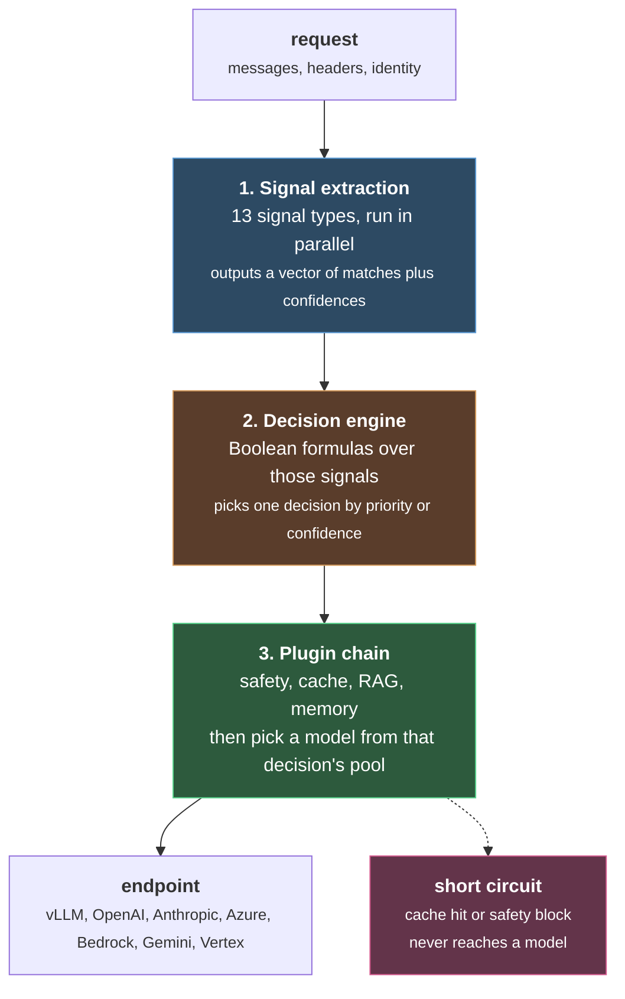
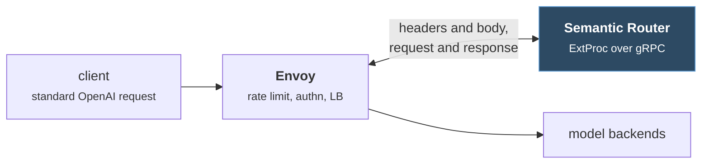

 # vLLM Semantic Router

#vllm #routing #inference #llmops

Sources: [white paper](https://vllm-sr.ai/white-paper.pdf) (June 2026) · [GitHub](https://github.com/vllm-project/semantic-router) · Apache 2.0 · v0.3 "Themis"

Deep dives, all read from source at commit `63e91c2`: [[Signal Extraction]] · [[Decision Engine]] · [[Plugin Chain]]

> [!warning] Paper and code disagree
> This page was written from the white paper. Reading the source afterwards turned up several counts that have moved on. **Signal types: 21, not 13. Selection algorithms: 16, not 13, and half are marked experimental.** The decision engine is three valued rather than Boolean. The deep dive pages are the accurate ones; corrections are marked inline below.

***

## The one line version

It sits in front of a fleet of models and decides, per request, **which model should answer this and what safety rules apply**, then gets out of the way.

Your client keeps sending ordinary OpenAI style requests to one endpoint. It has no idea any of this is happening.

## The problem it exists to solve

Model choice used to be a config value you set once. That stopped working, because fleets fragmented along four axes at the same time:

| axis | spread |
|---|---|
| modality | text, code, vision, diffusion |
| scale | 1B to 1T plus parameters |
| cost | roughly 10x variation in price per token |
| specialization | general purpose against domain tuned |

So now you have local vLLM boxes sitting next to OpenAI, Anthropic, Azure, Bedrock, Gemini and Vertex, all with different prices, capabilities and compliance stories. Every incoming request raises the same question: **who should serve this, and what should we do to it first?**

The paper's framing is that this is an uncertainty problem. Before you look at a request, all K models are equally plausible, so your uncertainty is `log2 K` bits. Every signal you extract knocks that number down. When it hits near zero, you have your answer. Nice framing, and honestly the system makes sense without it.

**What makes it different from earlier work:** RouteLLM, RouterDC and AutoMix all solve model selection on its own. This one bundles selection together with safety enforcement, caching, provider auth and plugins in a single pass. That integration is the actual pitch.

## The architecture

Three layers. Signals in, Boolean decision in the middle, plugins and model choice on the way out.



The clean part of this design is that **each decision carries its own model pool**. A decision tagged as privacy sensitive simply cannot reach a cloud model, because those models were never in its candidate set. Safety comes from the structure rather than from a check someone might forget to write.

### Layer 1: signals

> **Correction from source.** The code has **21** configurable signal types, not 13. The eight the paper omits are `reask`, `structure`, `kb`, `conversation`, `event`, `metadata`, `classifier` and `input_modality`. See [[Signal Extraction]].

Signals split by whether they need a neural forward pass:

| kind | signals | latency |
|---|---|---|
| **heuristic** | keyword, context length, language, authorization | sub millisecond |
| **learned** | embedding, domain, complexity, modality, factual grounding, preference, user feedback, jailbreak, PII | 10 to 120 ms |

Two implementation choices worth noticing:

**Only signals that some active decision actually references get computed.** If your config never mentions modality, the modality classifier never runs. Demand driven, so an unused capability costs you nothing.

**Everything runs in parallel**, so your wall clock cost is the slowest active signal rather than the sum. In practice that means roughly 120 ms, set by domain classification.

**Why encoders and not decoders.** The signal models are bidirectional encoders like ModernBERT, not causal decoders, and the paper argues this is principled rather than merely cheaper. Routing is a comprehension task. A bidirectional encoder sees the full context in both directions, while a decoder only ever sees leftward and optimizes for continuing text. Two granularities get used: pooled CLS vectors where only the global topic matters (domain, jailbreak, modality), and per token hidden states where **position** matters, which is what PII detection and hallucination span marking need.

### Layer 2: decisions are Boolean logic, almost

> **Correction from source.** The engine is **three valued**: true, false, and unknown. A signal that fails evaluates to unknown, and each decision declares an `on_unknown` policy of match, no_match or fail_request. That third state is the difference between a guardrail failing silently and failing loudly. See [[Decision Engine]].

A decision is a name, a Boolean formula over signal conditions, a candidate model pool, a plugin config and a priority. The formula is a tree, so it nests arbitrarily, and the exotic operators fall out of the three primitives:

```
nor(A, B)  = not(or(A, B))
nand(A, B) = not(and(A, B))
xor(A, B)  = or(and(A, not(B)), and(not(A), B))
```

Flat single level AND or OR is the recommended shape for most policies. Nesting is there when you need it. Confidence for a matched decision is the mean confidence across the conditions that fired, which is how competing matches get ranked.

The whole engine costs **under 0.5 ms even at 100 decisions with 5 conditions each**. Decision evaluation is free. Signal extraction is where your latency actually goes.

### Layer 3: plugins, then the model

Pre routing plugins run before any model is called: safety blocks, semantic cache lookup, RAG injection, memory retrieval, system prompt augmentation, provider auth headers. Then a selection algorithm picks from the decision's pool. Post routing plugins run on the response: hallucination checks, cache writes, format translation.

## How it actually plugs in

It runs as an **Envoy External Processor**, a gRPC service Envoy calls at four points in the request lifecycle.



Two things follow from this choice. **Clients need no changes at all**, since they speak plain OpenAI protocol to what looks like a normal endpoint. And the router **sits in a normal Envoy filter chain**, so your existing rate limiting and auth filters keep working next to it rather than being reimplemented inside it.

The processor can also return an immediate response, which is how a cache hit or a blocked jailbreak skips the backend entirely.

## Picking the model

> **Correction from source.** The catalog holds **16** algorithms and tiers them. Eight are `experimental`, including every classical ML method below and AutoMix. Thompson Sampling and GMTRouter do not appear in the code at all. See [[Plugin Chain]].

Algorithms sit behind one interface, `(query embedding, domain, candidates) → (model, confidence)`. The objective is quality minus a cost penalty you tune.

| family | algorithms | idea |
|---|---|---|
| rating | Static, Elo | fixed scores, or Bradley Terry ratings updated from user preferences |
| embedding | RouterDC | dual contrastive encoders, pick by cosine similarity |
| cascading | AutoMix | start cheap, escalate only when needed |
| classical ML | KNN, KMeans, SVM, MLP | train on past routing records with quality labels |
| reinforcement | Thompson Sampling, GMTRouter | Beta posteriors, or a graph net over user, query and model interactions |
| latency aware | Latency Aware | track live TTFT and TPOT percentiles, route around a degraded backend |
| multi round | ReMoM | fan out to several models, then have an LLM synthesize the answers |

Because they share an interface you get three things nearly free: **different algorithms per decision** (cascade for cost sensitive traffic, RouterDC for quality sensitive), A/B testing on live traffic, and ensembles.

ReMoM is the odd one out and worth understanding separately. It is not really selection, it is parallel reasoning. You give it a breadth schedule like `[4, 2]`, meaning four parallel calls, then two synthesis calls, then a final single one. Expensive by construction. Aimed at hard queries where you would rather pay several times over than be wrong.

Selection is also **two stage** in multi provider setups. The algorithm picks the best model semantically, then a separate endpoint router resolves that model to the cheapest provider serving it. Quality question and cost question, answered separately.

## Safety

Three subsystems, all composable per decision rather than global:

* **Jailbreak detection**, including a contrastive variant.
* **PII detection** at token level, since you need the spans and not just a yes or no.
* **HaluGate**, a three stage hallucination pipeline: a cheap sentinel gate decides whether the response is even a factual claim worth checking, then token level detection, then NLI based explanation. Gating first is the point, because it means you skip verification on the many queries where hallucination is not a meaningful concept. Claimed to cut average detection cost roughly in half.

## The engineering underneath

This is where the paper gets concrete, and where most of the measured wins live.

**LoRA for the classifiers.** Rather than n separately fine tuned models, one base model plus tiny adapters. Each task still needs its own forward pass, so this buys memory and not speed:

| tasks | independent | LoRA |
|---|---|---|
| 1 | 573 MB | 573 MB |
| 3 | 1,719 MB | 574 MB |
| 6 | 3,438 MB | 575 MB |

**Four inference runtimes**, chosen per workload: Candle for GPU classification, Linfa for CPU classical ML, ONNX Runtime for embeddings, and native bindings for keyword work.

**Flash attention was load bearing, not a nice to have.** Standard SDPA materializes the full quadratic attention mask, and with three classifiers sharing a GPU that runs out of memory past 4K tokens. Swapping in AMD Composable Kernel tiled attention fixed both the ceiling and the speed:

| sequence length | SDPA | flash attention |
|---|---|---|
| 2,048 | 51 ms | 32 ms |
| 4,096 | 167 ms | 51 ms |
| 8,192 | out of memory | 105 ms |
| 32,768 | out of memory | 756 ms |

Long context routing simply does not work without it. That is a real result, not a benchmark flourish.

## The central claim

**Same binary, same architecture, different YAML.** Deployment scenarios that sound like they need separate systems are configurations:

| scenario | signals | selection | plugins |
|---|---|---|---|
| healthcare, privacy regulated | authz, domain, language | static, compliant models only | strict PII redaction, no caching, audit logs |
| developer tool, cost optimized | complexity, embedding, keyword | AutoMix cascade | aggressive semantic cache |
| multi cloud enterprise | domain, modality, authz | latency aware | endpoint failover, provider auth injection |
| multi turn assistant | embedding, feedback, preference | Elo with session pinning | Responses API state, memory, RAG |

This is the thesis of the whole paper. Whether it holds up is mostly a question of whether the thirteen signals really span what deployments need, and that is not something a paper can settle.

There is also a typed configuration DSL with a real grammar, three levels of validation, and compilation to flat YAML, Kubernetes CRDs or Helm. It round trips, so you can decompile and edit. The paper argues its functional completeness means a coding agent can synthesize routing policies from a plain English description.

## Numbers worth remembering

| thing | number |
|---|---|
| heuristic signals | sub millisecond |
| ML signals | 15 to 120 ms, parallel, so slowest wins |
| decision engine, 100 decisions | under 0.5 ms |
| LoRA memory saving at 6 tasks | about 6x |
| flash attention at 4K tokens | 3.3x faster, and no OOM |
| semantic cache, exact match | 100% hit rate, under 5 ms |
| semantic cache, paraphrase | 60 to 80% hit rate at threshold 0.92 |
| HaluGate | roughly 50% cheaper on average |
| project | 5.6k stars, 2,073 commits, 50 plus contributors |

## Reading it critically

A few things I would want to check before believing all of it:

**The latency story has a seam in it.** The conclusion advertises "sub 10 ms signal extraction," but the measured table puts ML signals at 15 to 120 ms. Both can be true if the fast number refers only to heuristic signals and Rust bindings, but as written they sit awkwardly together. If you care about the tail, assume roughly 120 ms of added latency whenever a domain classifier is in the path.

**Routing quality is barely evaluated.** There is a great deal of systems measurement here, latency, memory, throughput, cache hits, and very little on whether the routing decisions are actually good. "Eight scenario profiles validate correct model selection" is a test suite, not a quality benchmark. No head to head against RouteLLM on shared data.

**Thirteen selection algorithms is a lot.** It reads as a menu rather than a recommendation. There is no guidance on which to reach for, and no comparison showing when the sophisticated ones beat plain static routing.

**The entropy framing is decoration.** Elegant, and the figure captions admit the bar heights are "schematic rather than empirical measurements." The architecture stands on its own. Do not mistake the framing for a result.

None of that makes it a bad system. The composability argument is genuinely good and the engineering is real. It is just that the paper is strongest exactly where papers usually are weakest, on systems detail, and weakest where you would most want evidence.

## Trying it

```bash
curl -fsSL https://vllm-sr.ai/install.sh | bash -s -- --channel dev
```

There is a hosted playground at `app.vllm-sr.ai`, plus Kubernetes manifests and Docker in the repo. Read the install script before piping it to a shell, as always.

***

## Open

* [ ] Work out what a minimal useful config looks like. How few of the thirteen signals can you turn on and still get value?
* [ ] Compare against plain RouteLLM on the same traffic. Is the extra machinery paying for itself?
* [ ] Measure the real added latency on a request that touches no ML signals at all
* [ ] Look at how the semantic cache handles a paraphrase that changes the answer, since 60 to 80% hit rate cuts both ways
