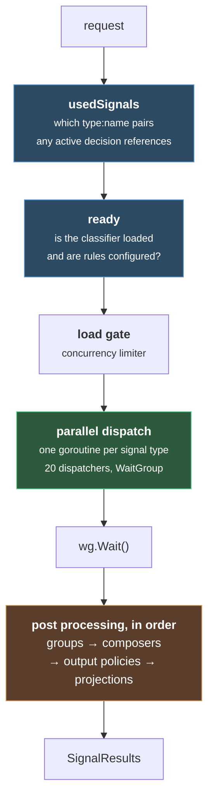

# Signal Extraction

#vllm #routing #inference #llmops

Layer 1 of [[Overview]] · [[Decision Engine]] · [[Plugin Chain]]

Read from source at commit `63e91c2`. Package `pkg/classification`, types in `pkg/config`.

***

## What this layer does

It takes a request and produces a **signal result**: a bag of matched rule names, plus a confidence and sometimes a raw numeric value for each one. That bag is the only thing the decision engine ever sees. Everything downstream is pure logic over this.

The shape it produces, from `SignalResults`:

```go
SignalConfidences  map[string]float64 // "embedding:ai" → 0.88
SignalValues       map[string]float64 // raw numbers, for predicates
SignalErrors       map[string]string  // "type:name" → what went wrong
SignalErrorMatches map[string]bool
```

Keys are always `signalType:ruleName`. Hold onto that, because the decision engine looks up conditions by exactly that string.

## How many signal types there actually are

**The paper says thirteen. The code has twenty one.** The authoritative list is `supportedSignalTypes` in `pkg/config/routing_surface_catalog.go`, and it is what config validation checks against:

| | | | |
|---|---|---|---|
| `authz` | `complexity` | `context` | `conversation` |
| `domain` | `embedding` | `fact_check` | `jailbreak` |
| `keyword` | `language` | `modality` | `pii` |
| `preference` | `reask` | `structure` | `kb` |
| `user_feedback` | `event` | `metadata` | `classifier` |
| `input_modality` | | | |

There is a twenty second constant, `projection`, which is not in that catalog because you never author it. It is **derived** from other signals during post processing, and only then becomes matchable.

The eight that the paper does not describe are worth knowing, because several are the ones you would actually reach for:

| signal | what it is |
|---|---|
| `reask` | user is asking the same thing again, detected across turns. A dissatisfaction proxy |
| `structure` | shape of the message, for example many questions in one turn |
| `kb` | matched a configured knowledge base label or group |
| `conversation` | shape of the conversation as a whole |
| `event` | event type, severity, temporal and action codes |
| `metadata` | untrusted request metadata, kept deliberately separate |
| `classifier` | any generic classifier you register. Predicate only |
| `input_modality` | structural presence of an image or audio attachment, no model needed |

Note `metadata` being called out as untrusted in the code. Request metadata is attacker controlled, so it gets its own signal type rather than being blended into the others.

## The evaluation pipeline



### Demand driven evaluation is real

This is the claim I most wanted to check, and it holds. From `runSignalDispatchers`:

```go
if isSignalTypeUsed(usedSignals, d.signalType) && ready[d.signalType] {
    wg.Add(1)
    go func(dispatch signalDispatch) {
        defer wg.Done()
        dispatch.evaluate()
    }(d)
    continue
}
```

**Two independent gates, both must pass.** A signal type runs only if some active decision references it *and* its classifier is actually loaded. Configure a modality rule but leave the modality detector disabled and the signal silently never runs, which is the sort of thing that makes a routing policy quietly stop working.

`usedSignals` gets computed three different ways:

| mode | what it evaluates |
|---|---|
| `forceEvaluateAll` | every signal type, used for debugging and the classify API |
| scoped to decisions | only what this recipe's decisions reference |
| default | everything referenced anywhere in config |

### Readiness is per signal and quite specific

The `signalReadiness()` map is twenty entries, and each one has its own notion of ready. A few examples:

```go
SignalTypeKeyword:   c.keywordClassifier != nil,
SignalTypeFactCheck: len(c.Config.FactCheckRules) > 0 && c.factCheckClassifier != nil
                     && c.factCheckClassifier.IsInitialized(),
SignalTypePII:       len(c.Config.PIIRules) > 0 && c.IsPIIEnabled(),
```

Jailbreak gets its own function rather than a one liner, and the comment explains why. Jailbreak has two backends, a BERT classifier needing Prompt Guard assets and a contrastive path needing only embeddings. Coupling both to one enabled flag meant that **disabling the optional Prompt Guard model silently killed otherwise healthy contrastive rules**. Someone hit that and fixed it.

### The load gate

Not in the paper at all, and a nice piece of design. It is a two tier concurrency limiter:

```go
bypassAllowance := threshold - 1
gatedSlots := maxConcurrency - bypassAllowance
```

Under `threshold` concurrent signal evaluations, requests sail through untouched. At or above it, they must grab one of `gatedSlots` channel slots and block until one frees. So the limiter **costs nothing at low load** and only engages when you are actually busy. That matters because this sits on every request's critical path.

### One image, one forward pass

When a request carries an image, two signals want its embedding: complexity (for image difficulty rules) and embedding (for image modality rules). Both pull it over FFI. So the code allocates a request scoped cache and whichever runs first donates its result to the other, turning two SigLIP forward passes into one. With no image attached the cache is left nil and neither signal touches it.

Small optimization, but it tells you the cost model here is dominated by neural forward passes rather than by anything in the Go code.

## Post processing is a real pipeline

After `wg.Wait()`, four passes run **in a fixed order**:

```go
results = c.applySignalGroups(results)
results = c.applySignalComposers(results)
results = c.applySignalOutputPolicies(results)
results = c.applyProjections(results)
```

The paper describes signal extraction as parallel extraction and stops there. In the code, roughly a third of the interesting behavior lives in these four passes: grouping related signals, composing new signals from existing ones, applying output policies, and finally projecting derived values that decisions can then match on. `projection` signals only exist after this stage.

## Keyword, the one signal with no model

Worth its own section because it is the cheapest signal and the one you will write most.

**Three methods, and only three.** Regex is the default when `method` is omitted:

| method | engine | default threshold |
|---|---|---|
| `regex` | Go regexp, word boundaries | matches give confidence 1.0 |
| `bm25` | Rust binding over FFI | 0.1 |
| `ngram` | Rust binding, character n grams | 0.4, arity 3 |

Operators are `AND`, `OR`, `NOR`, validated at construction. Anything else is a hard error.

**Fuzzy is not a method.** This trips people up. There is no `method: fuzzy`. Fuzzy is a *modifier* on the regex path, switched on with `fuzzy_match: true` and tuned with `fuzzy_threshold`, and it works by Levenshtein distance over words. The constructor is explicit:

```go
return nil, fmt.Errorf("unsupported keyword rule method: %q for rule %q (valid: regex, bm25, ngram)", ...)
```

⚠️ **The shipped `config/config.yaml` gets this wrong.** At line 173 it declares `method: fuzzy` on the `fuzzy_sensitive_keywords` rule. That string appears exactly once in the whole repository, no normalization maps it to anything, and `NewKeywordClassifier` returns an error for it which the caller propagates rather than swallowing. I did not run it, so I cannot swear to the runtime behavior, but read literally that example config fails to build its keyword classifier. The rule wants `method: regex` with `fuzzy_match: true`.

## Embedding rules

Cosine similarity against a set of text anchors you write out longhand:

```yaml
- name: technical_support
  threshold: 0.75
  aggregation_method: max
  candidates:
    - how to configure the system
    - installation guide
    - troubleshooting steps
```

`aggregation_method` is one of `mean`, `max`, `any`, which decides how multiple candidate similarities collapse to one score. There is also `query_modality`, defaulting to `text`, which you can set to `image` or `audio`. The candidates stay text in every case. The rule matches a text anchor set against a query embedded from whichever modality you named, all inside one shared multimodal space, so it needs a multimodal embedding model configured.

## Jailbreak has three methods and a validator that exists for a reason

`contrastive`, `classifier`, and `model`, where empty string and `model` both mean the classifier path. The validator's comment is the most useful thing in the file:

> Without validation, an unrecognised value is not an error but a silent downgrade: a rule written as `method: hybrid` with jailbreak_patterns still loads, still reports healthy, and never consults a single pattern. A guardrail that silently ignores half its configuration is worse than one that refuses to start.

That is a good instinct, and it is the failure mode to watch for across this whole layer. Signals fail quietly by design, since one broken classifier should not take down routing. The cost is that a misconfigured guardrail looks exactly like a working one.

## Worked example

Same request used across [[Overview]], [[Decision Engine]] and [[Plugin Chain]]:

> `urgent: our production API is timing out, help me debug this`

Against the shipped `config/config.yaml`, here is what this layer actually does.

**Runs, and matches:**

```
keyword:urgent_keywords   ✅  ngram, arity 3, threshold 0.4   → "urgent"
keyword:code_keywords     ✅  bm25, threshold 0.1             → "debug"
domain                    →   "computer science"              ModernBERT
```

**Runs, and does not match.** This still costs you the forward pass:

```
jailbreak:prompt_injection  ✗  contrastive, threshold 0.8
keyword:machine_learning    ✗  bm25, no ML terms present
```

That jailbreak evaluation is not wasted work even though it found nothing, because `safe_only_svm_route` is written as `NOT[jailbreak:prompt_injection]`. **A negative result is a positive input to a rule.**

**Skipped entirely.** Not because they failed, but because the two gates said no:

| signal | why skipped |
|---|---|
| `pii` | gate 2, ready is false unless `PIIRules` exist and PII is enabled |
| `modality` | gate 2, needs `ModalityRules` plus the detector switched on |
| `kb`, `event`, `metadata` | gate 1, no active decision references them |

Every one of those skips removes a forward pass from the critical path.

### What this costs

The signal result handed upward is just a bag of strings and floats:

```
SignalConfidences {
  "keyword:urgent_keywords": 1.0,   ← structural, keyword reports no degree
  "keyword:code_keywords":   1.0,   ← structural
  "domain:computer science": 0.91,  ← real, reported by the classifier
}
```

Note the mix. Two of those 1.0 values are placeholders standing in for "matched, no opinion on how strongly," and one is a genuine score. That distinction is invisible here but decides how ranking behaves one layer up, which is the `ConfidenceScored` story in [[Decision Engine]].

Wall clock is set by the domain classifier, the only ML signal on this path, so roughly 50 to 60 ms by the paper's table. The two keyword signals contribute microseconds. **Had this config referenced no learned signals at all, routing would have cost essentially nothing.**

## Latency, honestly

The paper's table puts heuristic signals under a millisecond and ML signals between 15 and 120 ms, with parallel evaluation meaning you pay the slowest rather than the sum. The conclusion of the same paper claims "sub 10 ms signal extraction latency," which cannot be describing the same thing. Nothing in the code resolves this, since these are measurements rather than constants. Assume the table.

The structural point the code does support: **your latency is set by the slowest active ML signal**, and the two gates decide which signals are active at all. Turning off a signal type you do not reference is not a micro optimization here, it removes a forward pass from the critical path.

***

## Open

* [ ] Confirm whether `method: fuzzy` in the shipped config actually breaks startup, by running it
* [ ] Read `applySignalComposers` and `applyProjections` properly. They are a third of this layer and the paper skips them
* [ ] Work out what the minimum viable signal set is. Keyword plus domain plus authz covers a lot and costs one forward pass
* [ ] Check whether `metadata` signals can influence a decision that grants model access, since they are attacker controlled by construction
